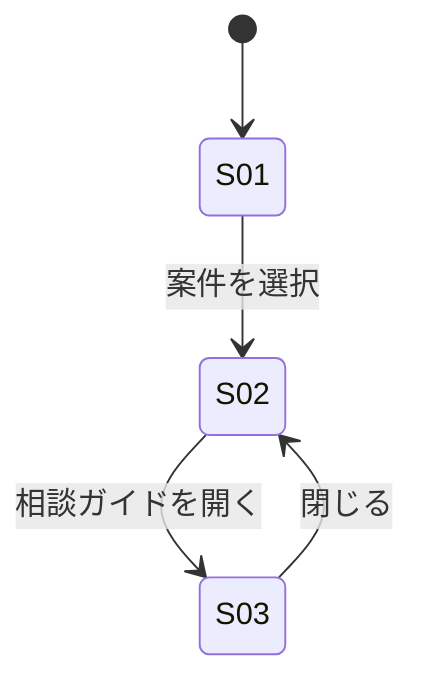

# 画面仕様（`screens.md`）と実コンテンツ（`content.md`）

**「何が必要か」と「どう見えるか」の間にある層。**
`requirements.md` の Must Have から、**画面は何枚で、各画面に何が乗り、どう繋がるか**を決める。

これが無いと `figma_make_prompt.md` の Elements 節が書けない。

## いつ作るか（D-00 で判定）

| 成果物 | 作る条件 |
|---|---|
| `screens.md` | 画面が**2枚以上**／情報設計が支配的／Must Have から画面構成が一意に決まらない |
| `content.md` | **コンテンツ駆動型**である ―― 画面の主役が「表示するテキスト・データ」そのもの |

入力と結果表示が主役のプロダクト（1画面・1入力）では、どちらも作らない。冗長になるだけである。

> **コンテンツ駆動型の見分け方**
> 画面から文字を全部消したとき、**製品として何も残らない**なら該当する。
> 「判断基準を見せる」「手順を案内する」「情報を比較させる」プロダクトはすべてこれ。

---

## 導出の順序

```
Must Have（何ができる必要があるか）
   ↓  目的が異なるものを束ねる
画面（1画面 = 1目的）
   ↓  その目的を果たすために必要な情報は何か
表示要素（Information）
   ↓  そこで何ができるか
アクション（Action）と遷移
   ↓  コンテンツ駆動型なら
実際に表示する文言（content.md）
```

**先に画面を思いつかないこと。** 目的の束から画面が決まる。逆をやると既視感のある構成に寄る。

---

## `screens.md` テンプレート

```markdown
# screens.md — 画面仕様（DRAFT）

## 画面一覧

| ID | 画面 | 目的（1文） | 由来する Must Have |
|---|---|---|---|
| S01 | 〈…〉 | 〈…〉 | M-1 |

## 画面遷移



## S01: 〈画面名〉

### 目的
〈単一の目的。2つ書けるなら画面を分けるべきである〉

### 表示要素（Information）
- 〈要素名〉**［第1］**: 〈何を伝えるか〉
- 〈要素名〉: 〈何を伝えるか〉

### 段階的開示（初期表示に出さないもの）
- 〈要素名〉: 〈何をすると出るか〉／〈初期表示に出さない理由〉

### アクション（Action）
- 〈動詞〉: 〈結果／遷移先〉

### 表示の分岐（空状態・条件付き表示）
- **空状態**: 〈データが0件のとき何を出すか〉
- **条件付き**: 〈○○が無い工程では△△ボタンを表示しない〉
```

### 「［第1］」と「段階的開示」を書く理由

**［第1］は階層である。** 1画面につき1つだけ付す。2つ付けたくなったら、その画面は
2つの目的を持っている ―― 画面を分ける合図である。これが無いと Figma Make は
全要素を等価な重みで並べ、「情報はあるが、どこを見ればいいか分からない画面」を作る。

**段階的開示は認知負荷の設計である。** 「今この瞬間に不要な要素」を初期表示から外す。
外す判断には理由が要る。理由を書けない要素は、外すべきでないか、そもそも不要である。

どちらも C-2（タスク）から導出する。意匠の好みではない。
詳細は `aesthetic-guardrails.md` §3 を参照すること。

### 「表示の分岐」を必ず書く理由

プロトタイプの完成度は、**正常系より空状態と分岐**で決まる。
データが0件のとき、条件を満たさないとき ―― ここが未定義だと、
Figma Make は「常に全部表示される理想状態」だけを作り、**動かした瞬間に破綻する**。

DRAFT では要点だけでよい。網羅は ITERATE パスで行う。

---

## `content.md` テンプレート（コンテンツ駆動型のみ）

```markdown
# content.md — 画面表示コンテンツ（DRAFT・仮説）

> ⚠️ 本書の内容は、briefing.md / requirements.md の記述をもとに作成した**仮説**である。
> 実務上の妥当性は未検証であり、次回商談での確認を要する。
> Open Questions に「コンテンツの妥当性確認」を必ず起票すること。

## 〈コンテンツの単位〉

### 1. 〈項目名〉
- **〈区分〉**: 〈実際に画面へ表示する文言そのまま〉
```

### 記述規約

- **書くのは「実際に画面に出る文字列」**である。仕様の説明文ではない
- **`briefing.md` / `requirements.md` に根拠を持たない内容を創作しない。**
  業務知識を勝手に発明すると、お客様の前で「それ違います」と言われる
- 根拠が薄い項目は、**その旨を明記**して Open Questions に送る
- 表示形式（テーブルかカードか）は書かない。それは `screens.md` と `Guidelines.md` の領域

---

## DRAFT 時の分量

| 成果物 | 目安 |
|---|---|
| `screens.md` | **1画面あたり 30〜45行**（4画面なら 120〜180行） |
| ├ うち「段階的開示」 | **最大3項目**。外すものが無ければ `なし` と1行だけ書く |
| `content.md` | 主要な導線に必要な分だけ。網羅は ITERATE |

`screens.md` は他の DRAFT 成果物より厚くなる。**ここを削ると Figma Make が推測で埋めるため、
削っても総時間は減らず、品質だけが落ちる。**

---

## 下流への効き方

```
screens.md      「案件名」「現在地ラベル」／遷移／空状態  ← 何を、どういう構造で
content.md      「デザインコンセプトの決定」            ← 実際に出る文字列
Guidelines.md   --font-size-body / --color-accent      ← どう見せるか
       ↓
figma_make_prompt.md
```

`figma_make_prompt.md` には、**「ダミーテキストでの生成を禁止し、`content.md` の文言をそのまま使う」**
という指示を必ず含めること。これが無いと、コンテンツ駆動型のプロトタイプは
それらしいダミー文で埋まり、**製品として何も伝わらないものになる。**
