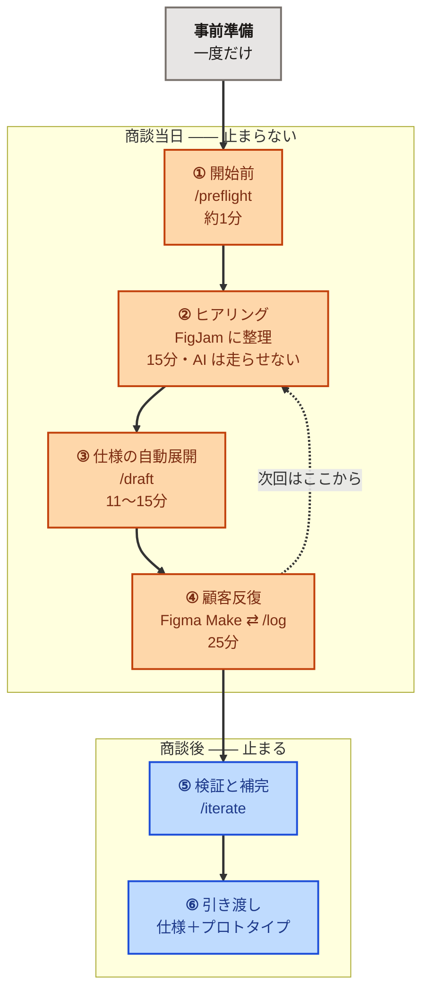
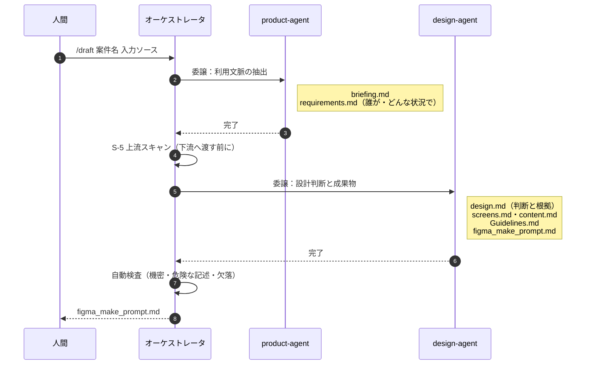
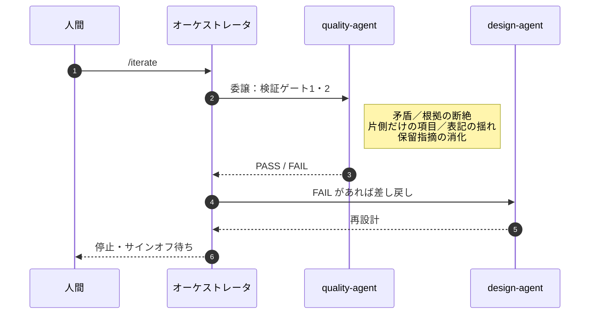
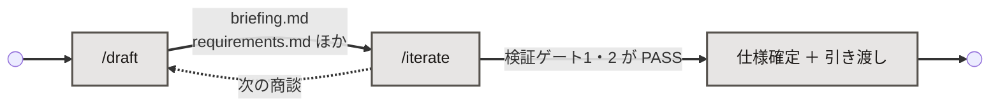

# ワークフロー

お客様と話しながら、その対話の最中に仕様を立ち上げ、そのまま画面まで到達させる。
商談1件を、準備から実装まで通したときの流れ。

---

## 実測値

改善は2回。それぞれ**同一の入力**で前後を計測した。

| | 改善前 | 改善後 | | 何を直したか |
|---|---:|---:|---|---|
| ① | 21分50秒 | **11分31秒** | ▲47% | 分量制限が、書くエージェントの読まないファイルにあった |
| | 866行 | **331行** | ▲62% | |
| ② | 17分09秒 | **11分50秒** | ▲31% | 成果物ごとに委譲し、起動時間が積み上がっていた |
| | 委譲6回 | **2回** | ▲67% | 画面は3→4に増えたうえでの短縮 |

①のあとに検査と成果物を追加したため、②の開始時点では17分09秒まで戻っている。
**11分31秒と17分09秒は地続きではない。**

### 何を計測したのか

| # | 工程 | 時間 | 精度 |
|---|---|---:|---|
| ① | 仕様生成（入力 → `figma_make_prompt.md`） | **11分50秒** | 実測 |
| ② | ファイル添付とプロンプト貼付（人手） | **30秒** | 実測 |
| ③ | Figma Make の生成 | 7分〜15分17秒 | 同一入力でも変動 |
| | **画面到達まで** | **約20〜28分** | ③は範囲で記録 |

**短縮できたのは①だけである。** ②は人手だが30秒しかなく、③は外部サービスの都合で制御できない。
③は同一プロンプトで7分と15分17秒を計測しており、生成量ではなく Figma Make 側の変動が支配変数である。
**したがって DRAFT の生成範囲を削っても③は短くならない。** 仕様の質だけが失われるため、スコープは変更しない。

```
現在値   仕様生成 11分50秒 ／ 4画面 ／ 466行 ／ 委譲2回 ／ 検査 全8件 PASS
```

---

## 全体像



> 図中の配色は、文字と背景で 6.9:1 以上、境界と背景で 3.8:1 以上を実測して選定している
> （WCAG の基準はテキスト 4.5:1、非テキスト 3:1）。ダークモードでも同じ見え方になる。

---

## 中核となる設計判断

### 検証は、商談中に回さない

検証してサインオフするのは自分自身である。そしてお客様の前で、自分は喋っている。
**レビューは物理的に不可能**であり、そこで止まるのはお客様の時間を捨てているだけになる。

そこで同じ成果物を**2周**する。

| | **DRAFT**（商談中） | **ITERATE**（商談後） |
|---|---|---|
| 優先するもの | 画面に到達する速さ | 矛盾がないこと |
| 問題を見つけたら | 記録して先へ進む | 止めて差し戻す |
| 人間の確認待ち | なし | 各段階であり |
| 生成量 | 最小限 | 全成果物 |

速さと堅さは相反するように見えて、**時間軸をずらせば両立する**。
商談中は止まらない。検証は商談と商談の「あいだ」で回す。
結果として、**次の商談は前回より精度が上がった状態から始まる**。

### 具体値は、決めずに導出する

再利用層（エージェント定義・方法論）には、**色もフォント名もレイアウトも書かれていない**。
すべての具体値は、その案件の利用状況から計算した結果として出力される。

```
「夜は照明を落としている」（ヒアリングで得た一言）
        ↓  周囲の明るさ → 目の順応状態 → 画面の明暗
背景は暗い配色（棄却した選択肢と、この判断が崩れる条件つき）
```

同じ仕組みが、屋外・直射日光の案件では**明るい配色**を導出する。
好みで選んでいないことが、2案件の成果物を並べれば確認できる。

---

## 商談60分の時間配分

```mermaid
gantt
    dateFormat HH:mm
    axisFormat %H:%M
    title 60分の商談における配分（実測に基づく）

    section 人間が主導
    ヒアリング（FigJam に整理）  :done, h1, 00:00, 15m
    顧客反復（見せる・直す）      :active, h2, 00:42, 13m
    まとめ                      :h3, 00:55, 5m

    section AI が主導
    /draft 仕様生成 実測11分50秒  :crit, a1, 00:15, 12m
    Figma Make 生成 7〜15分       :crit, a2, 00:27, 15m
```



**ここで直視すべきは、顧客反復に使える時間が13分しか残らないことである。**
`/draft` が12分、Figma Make の初回生成が最大15分。合計27分が生成に費やされる。

Figma Make の生成時間は外部サービスの都合であり、こちらでは短縮できない（同一入力で7分と15分17秒を計測）。
したがって**反復の回数を確保する手段は、生成そのものを軽くすることだけ**である。

> **初回は1画面だけ生成させる。** 仕様は4画面ぶん持ったまま、Figma Make に渡す範囲を絞る。
> 合意が取れてから残りを足す。これは実行時の判断であり、仕様の範囲を狭めることではない。

### 待ち時間は無言の時間ではない

生成中も画面を共有しながら喋る。

> 「いま伺った内容を要件に落としています」
> 「屋外で直射日光という条件が、この後の配色の決め手になります」

**待ち時間を説明時間に変えられるかどうかが、この工程の実質的な要件になる。**
27分を沈黙で過ごせば商談は終わる。ここは仕組みではなく、人間側の準備で決まる。

---

## エージェントの連鎖

3体は決まった記号で受け渡しをする。**この鎖が切れると設計が導出できない。**

**DRAFT ―― 商談中。止まらない**



**ITERATE ―― 商談後。止まる**



```
product-agent        design-agent            quality-agent
─────────────        ────────────            ─────────────
誰が・どんな状況で  →   配色・操作位置の決定  →   「その決定はどの発言に由来するか」
（ヒアリングから）                                 遡れなければ差し戻し
```

**`quality-agent` が DRAFT に登場しないのは、意図した設計である。**
商談中に委譲すると、コールドスタートで1〜2分を失う。
そこで DRAFT では**オーケストレータ自身が要点だけを高速スキャン**し（解法の混入・機密の平文・
危険な DOM 操作・利用状況の欠落）、フル検査は ITERATE で `quality-agent` が行う。

緩めているのは**検査の実行タイミングであって、検査そのものではない。**

---

## 各フェーズ

### ⓪ 事前準備（一度だけ）

`local_env.json` を作り、一度 `/draft` を通して権限を「常に許可」で埋めておく。

この時点でリポジトリには**仕組みしかない**。案件フォルダは存在しない。
**案件についての情報は、すべてお客様との対話から生まれる。**

### ① 商談開始前 ―― `/preflight`

接続・設定・検査スクリプト・権限を、**実際に叩いて**確認する。
継続案件では、前回の未確認事項を一覧表示する ―― これが商談前に叩く最大の実用価値になる。

```
1. FigJam 接続        ✅  要素56件を取得
2. 設定パラメータ      ✅  5項目すべてあり
3. エージェント／知識   ✅  3体・11ファイル・リンク切れなし
4. 出力先の衝突        ✅  なし
5. 検査スクリプト      ✅  全8件 PASS
6. 権限               ✅
本番可否: ✅ 走れます
```

Meet に入る前に済ませる。**お客様を待たせて点検する時間ではない。**

### ② ヒアリング（15分・AI は走らせない）

FigJam に整理しながら聴く。**ここは人間の仕事**である。

意識して拾うのは**装置・姿勢**と**周囲の環境**。この2つは本題の合間に一度だけ漏れることが多く、
落とすと後続の設計判断がすべて成立しない。

> 「その作業をしているとき、体は何をしていますか？」 ―― 手が空いているか
> 「まわりはどのくらい明るいですか？」 ―― 配色の決め手になる
> 「間違えたら、やり直せますか？」 ―― 取り消し導線の要否

### ③ 仕様の自動展開 ―― `/draft`（12分）

入力は3経路。第2引数の形で自動判別する。

| 経路 | 向いている場面 |
|---|---|
| FigJam の URL | 商談中にその場で構造化しながら聴く |
| `@` 付きファイル | 接続が使えない／短時間のヒアリング |
| そのままのテキスト | 口頭で出てきた話をその場で渡す |

長時間の録音や既存資料は、外部の整理ツール（NotebookLM 等）を通してから渡す。
ただし**商談中には使えない**（処理に時間がかかる）。

> **要約ツールには固有のリスクがある。** 要約は「何が欲しいか」を残し、
> 「**どんな状況で使うか**」を捨てる。後者が落ちると設計判断が成立しない。
> そのため「まとめて」ではなく「**発言をそのまま引用して**」と指示する。

生成される成果物は、案件の性質によって変わる。

| 成果物 | 内容 | 条件 |
|---|---|---|
| `briefing.md` | ヒアリングの整理 | 常に |
| `requirements.md` | 要件と、誰がどんな状況で使うか | 常に |
| `design.md` | 設計判断と、その根拠・崩れる条件 | 常に |
| `screens.md` | 画面構成・遷移・空状態 | 画面が複数あるとき |
| `content.md` | 画面に出る実際の文言 | 文言が製品の中身のとき |
| `Guidelines.md` | 配色・書体・余白の定義 | 常に |
| `figma_make_prompt.md` | Figma Make に貼るプロンプト | 常に |

**まず「この案件で勝負を決める判断は何か」を特定し、必要な成果物だけを作る。**
用意されたモデルを機械的に全部回すことはしない。
情報が無いところから結論を出すのは、導出ではなく儀式である。

> **2回目以降は継続モードで走る。** 前回を読み、**変わった箇所だけ**を更新する。
> 変わっていない箇所を再生成すると、前回お客様と合意した表現が理由なく変わるためである。

### ④ 顧客反復（13分・ここが本番）

1. 成果物5点を Figma Make へ添付し、プロンプトを本文に貼る（`briefing.md` は渡さない）
2. 出てきた画面をお客様に見せる
3. 修正依頼を受ける
4. **`Guidelines.md` の変換表**を経由して、定義済みの値の操作に翻訳する
5. 再生成して、また見せる

| お客様の言葉 | 変換先 | 操作 |
|---|---|---|
| 「もっと明るく」 | 背景色 | 明度を1段上げる（**明暗の方針は変えない**） |
| 「押しにくい」 | 押せる範囲 | 幅を広げるか、距離を縮める |
| 「地味」「華やかに」 | 差し色 | ❌ 面積を増やさない。鮮やかさか対比で解く |

最後の行が要点になる。**要望を断らずに、別解として返す。**
感覚で処理すると、3回目の修正で一貫性が崩れる。

反復のたびに、その場で1行だけ残す。

```
/log もっと明るく → 背景色

✅ #1  14:32:10  「もっと明るく」 → 背景色   （—）
✅ #2  14:34:20  「押しにくい」   → 押せる範囲 （前行から 2分10秒）
```

所要時間は前の記録との差から自動算出される。
**この記録が「速さ」を裏づける唯一の証跡**であり、仕様書に速度は残らない。

> **反復は2つある。** ④は**画面**を回し、⑤は**仕様**を回す。
> 商談中に仕様書を直すと止まるため、画面だけを回して `/log` で伝票を残し、
> そのズレを⑤で精算する。**`/log` が2つの反復を繋いでいる。**

#### ④の最後 ―― 出力を回収する（省略不可）

商談が終わったら、Figma Make の出力を `<案件>/figma_output/` に保存する。

**`/log` は伝票であって実物ではない。** Figma Make は依頼以上のことをしたり、
異なる解釈をしたりする。実物が無いと、**記録に無い変更**と**定義した値とのズレ**を検出できない。

コードで回収する。値を機械的に突き合わせられるため、画面写真より精度が高い。

### ⑤ 検証と補完 ―― `/iterate`

ここで初めて `quality-agent` が起動する。**問題があれば止めて差し戻す。**

| 検査 | 検出するもの |
|---|---|
| 矛盾 | 上流が禁止したことを下流が採用していないか |
| 根拠の断絶 | **由来を持たない設計判断**（＝設計者の好み）が混入していないか |
| 片側だけの項目 | 要件にあって設計にない／設計にあって要件にない |
| 表記の揺れ | 同じ値や名前が、文書ごとに食い違っていないか |

あわせて、商談中に溜めた保留指摘を1件ずつ判定し、
確定した仕様変更を**下流ではなく上流へ**反映する。

> **`/iterate` から先に始めることはできない。** 生成のパスではなく、検証と補完のパスである。
> 商談中の成果物が無ければ、生成せずに停止する。

### ⑥ 引き渡し ―― 範囲の終点

**範囲は、確定した仕様と動くプロトタイプまで。** 本実装は含まない。

商談で見せた画面は Figma Make が生成している。それを捨てて別実装を起こすと、
お客様が合意した画面と実装物が別々に育つ。整合を取る仕組みが要り、速度の利点が消える。

実装できる単位への分解（`tasks.md`）までを引き渡し資料として作り、
そこから先は受け取る側に委ねる。**線を引かないことは、責任範囲を曖昧にすることである。**

---

## コマンド一覧

各コマンドが何をするかは「各フェーズ」に書いた。ここでは**性質の違い**だけを並べる。

```
/preflight  商談前の点検          止まってよい
/draft      仕様と画面を「出す」   商談中・止まらない
/log        変更を「残す」        商談中・3秒
/iterate    仕様を「直す」        商談後・止まる
```

| | `/draft` | `/iterate` |
|---|---|---|
| いつ | 商談中。ヒアリング直後 | 商談後。自分の机で |
| 前提 | なし。案件フォルダも無くてよい | `briefing.md` と `requirements.md` があること |
| 止まるか | **止まらない**（権限プロンプト以外） | **止まる**（ゲートごとにサインオフ待ち） |
| 時間 | 実測 11分50秒 | 制限なし |
| 検証 | 記録するが止めない | 問題があれば差し戻す |
| 委譲 | 2回（`product-agent` / `design-agent`） | `quality-agent` へ検証を委譲 |

### 進行の条件

前のコマンドが何を残すかで、次に進めるかが決まる。



`/iterate` は **`briefing.md` / `requirements.md` が無ければ実行しない。**
DRAFT を飛ばすと、分量制限も自動検査も**顧客の実際の声**も失われる。
その状態で作った「完成版」は、仕様駆動ではなくただの推測である。

---

## よくある疑問

**Q. `/iterate` は商談中には使わない？**
使わない。商談中の反復は**画面**を回す（Figma Make）。`/iterate` は**仕様**を回す。
両者を繋ぐのが `/log` の伝票である。

**Q. 実装まではやらない？**
やらない。範囲は確定した仕様と動くプロトタイプまでである。
商談で合意した画面は Figma Make の出力であり、それを捨てて別実装を起こすと二重管理になる。
実装可能な単位への分解（`tasks.md`）までを引き渡し資料として作る。

**Q. 2回目の商談では？**
`/draft` からもう一度始める。前回の成果物がある案件フォルダを指定すれば、
既存を退避してから新しい入力で回す。

---

## 全フェーズ共通の規約

**モードによって緩めてよいのは「止まるかどうか」だけ。** 以下は商談中でも緩めない。

- **秘匿情報を成果物へ書かない** ―― 実URL・アクセスキー・個人が特定される内容
- **生の発言を下流へ転記しない** ―― 外部へ渡すファイルに引用として移せば、遮断した意味がなくなる
- **危険な DOM 操作を禁じる** ―― 生成コードにも適用し、機械で検出する
- **要件に技術的な解法を書かない** ―― 書くのは目的と制約

商談中でも、次の3つを検出したら**進行は止めずに即座に警告する**。

```
1. 機密情報の平文混入
2. 危険な DOM 操作の混入
3. 装置または物理環境の記述が完全に欠落している
```

前2つは事故に直結し、3つ目は後続の設計判断をすべて無効化するため、「後で直す」が成立しない。
