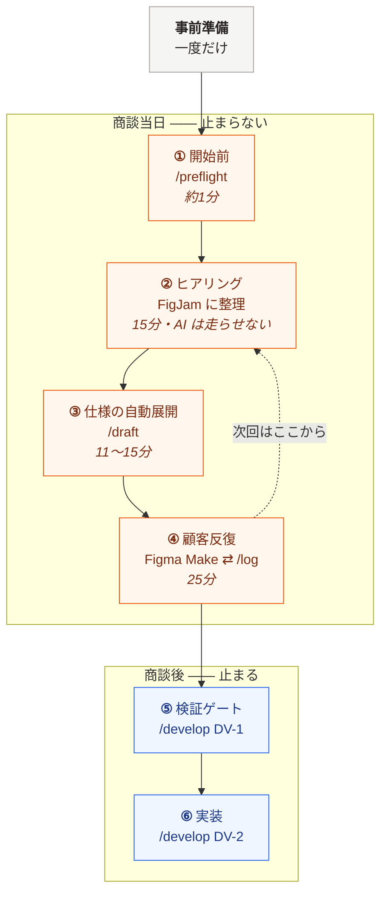
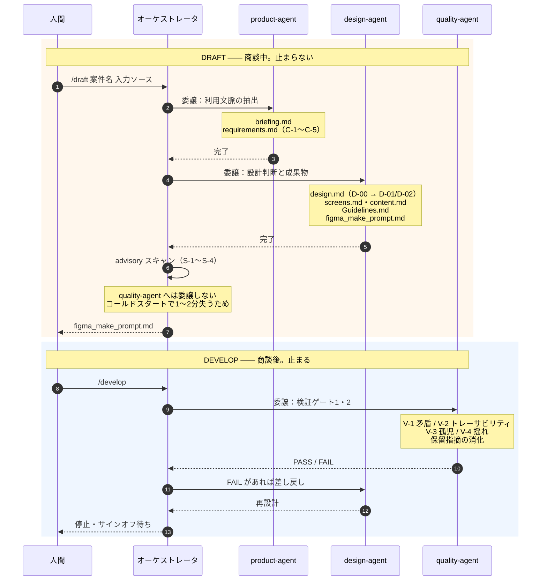

# ワークフロー

お客様と話しながら、その対話の最中に仕様を立ち上げ、そのまま画面まで到達させる。
商談1件を、準備から実装まで通したときの流れ。

---

## 実測値

同一の入力で2回計測し、構造を修正した前後を比較した。

| | 改善前 | 改善後 | |
|---|---:|---:|---|
| 画面到達までの所要時間 | 21分50秒 | **11分31秒** | ▲47% |
| 生成ドキュメント量 | 866行 | **331行** | ▲62% |
| サブエージェント委譲回数 | 5回 | **2回** | ▲60% |

遅さの原因は生成速度ではなく、**制約が届いていない場所に書かれていたこと**だった。
「速く書け」という指示は手順書にあったが、実際に書くエージェントはそれを読んでいなかった。
制約をエージェント自身が読む場所へ移し、分量目安を数値で与えたことで半減した。

---

## 全体像



---

## 中核となる設計判断

### 検証ゲートは、商談中に回さない

検証ゲートでサインオフする人間は自分自身である。そしてお客様の前で、自分は喋っている。
**レビューは物理的に不可能**であり、そこで止まるのはお客様の時間を捨てているだけになる。

そこで同じ成果物を**2周**する。

| | **DRAFT**（商談中） | **DEVELOP**（商談後） |
|---|---|---|
| 最適化する対象 | 画面に到達するまでの時間 | 論理的無矛盾とトレーサビリティ |
| 検証ゲート | **advisory** ―― 記録するが止まらない | **blocking** ―― FAIL なら差し戻し |
| 人間の停止 | なし | 各ゲート後にサインオフ待ち |
| 生成物 | 最小 | 全成果物 |

速さと堅さは相反するように見えて、**時間軸をずらせば両立する**。
商談中は止まらない。検証は商談と商談の「あいだ」で回す。
結果として、**次の商談は前回より精度が上がった状態から始まる**。

### 具体値は、決めずに導出する

再利用層（エージェント定義・方法論）には、**色値もフォント名もレイアウトも書かれていない**。
すべての具体値は、利用文脈を決定モデルに代入した計算結果として導出される。

```
「夜は照明を落としている」（C-4 物理環境）
        ↓  決定モデル①：環境照度 → 網膜の順応状態 → 輝度極性
D-01 = Dark（棄却した選択肢と再検討トリガつき）
```

同じエージェントが、屋外・直射日光の案件では **Light** を導出する。
好みで選んでいないことが、成果物の side by side で確認できる。

---

## 商談60分の時間配分

```mermaid
gantt
    dateFormat HH:mm
    axisFormat %H:%M
    title 60分の商談における配分

    section 人間が主導
    ヒアリング（FigJam に整理）      :done, h1, 00:00, 15m
    顧客反復（見せる・直す・見せる）   :active, h2, 00:30, 25m
    まとめ                          :h3, 00:55, 5m

    section AI が主導
    /draft 仕様の自動展開            :crit, a1, 00:15, 15m
```



**AI が走る15分は、無言の15分ではない。** その間も画面を共有しながら喋る。

> 「いま伺った内容を要件に落としています」
> 「屋外で直射日光という条件が、この後の配色の決め手になります」

待ち時間を説明時間に変えられるかどうかが、この工程の実質的な要件になる。

---

## エージェントの連鎖

3体は決まった記号で受け渡しをする。**この鎖が切れると設計が導出できない。**



```
product-agent        design-agent            quality-agent
─────────────        ────────────            ─────────────
C-1〜C-5        →    D-01 輝度極性      →    「D-01 は C のどれに由来するか」
（利用文脈）           D-02 操作アンカー        遡れなければ差し戻し
```

**`quality-agent` が DRAFT に登場しないのは、意図した設計である。**
商談中に委譲すると、コールドスタートで1〜2分を失う。
そこで DRAFT では**オーケストレータ自身が4点だけを高速スキャン**し（解法の混入・機密の平文・
DOM バインド規約・C-3/C-4 の欠落）、フル検査は DEVELOP で `quality-agent` が行う。

緩めているのは**検査の実行タイミングであって、検査そのものではない。**

---

## 各フェーズ

### ⓪ 事前準備（一度だけ）

- `local_env.json` を作る（`FIGJAM_URL` は案件ごとに差し替え）
- 一度 `/draft` を通し、権限プロンプトを「常に許可」で埋める
- `/agents` に3体、`/help` に4コマンドが出ることを確認

この時点でリポジトリには**仕組みしかない**。案件フォルダは存在しない。
**案件についての情報は、すべてお客様との対話から生まれる。**

### ① 商談開始前 ―― `/preflight`

MCP 疎通・設定・エージェント構成・出力先の衝突・権限を、**実際に叩いて**確認する。

```
1. FigJam MCP 疎通       ✅  要素56件を取得
2. 設定パラメータ         ✅  5項目すべてあり
3. エージェント/knowledge  ✅  3体・11ファイル・リンク切れなし
4. 出力先の衝突           ✅  なし
5. 権限                  ✅
本番可否: ✅ 走れます
```

Meet に入る前に済ませる。お客様を待たせて点検する時間ではない。

### ② ヒアリング（15分・AI は走らせない）

FigJam に整理しながら聴く。**ここは人間の仕事**である。

意識して拾うのは **C-3（装置・姿勢）と C-4（物理環境）**。
この2つは本題の合間に一度だけ漏れることが多く、落とすと下流の設計判断がすべて成立しない。

> 「その作業をしているとき、体は何をしていますか？」 ―― 把持姿勢
> 「まわりはどのくらい明るいですか？」 ―― 環境照度
> 「間違えたら、やり直せますか？」 ―― 可逆性

### ③ 仕様の自動展開 ―― `/draft`

```
/draft 設備点検アプリ https://www.figma.com/board/xxxxx
/draft 設備点検アプリ @inputs/hearing.md
/draft 設備点検アプリ 屋外で手袋をつけた作業員が…
```

第2引数は形で自動判別する（URL → FigJam / `@` → ファイル / それ以外 → メモ本文）。
**商談中に設定ファイルを開く必要はない。**

生成される成果物は、案件の性質によって変わる。

| 成果物 | 内容 | 条件 |
|---|---|---|
| `briefing.md` | SSoT（Why & Who） | 常に |
| `requirements.md` | 利用文脈 C-1〜C-5、Must Have | 常に |
| `design.md` | D-00 支配的判断 → 支配的なモデルの ADR | 常に |
| `screens.md` | 画面一覧／遷移図／表示要素／**空状態と条件分岐** | 複数画面・情報設計が主役のとき |
| `content.md` | 画面に出る**実際の文言** | コンテンツ駆動型のとき |
| `Guidelines.md` | トークン、**変更要求→トークン写像表** | 常に |
| `figma_make_prompt.md` | Figma Make 連携プロンプト | 常に |

**D-00 が案件の型を判定し、必要な成果物だけを作る。**
用意されたモデルを機械的に全部回すことはしない。情報が無いところから結論を出すのは、導出ではなく儀式である。

### ④ 顧客反復（25分・ここが本番）

1. **Figma Make** へ投入する（`figma_make_prompt.md` の形態は D-00 が決めている）
   - **自己完結型** ―― プロンプトを貼るだけ。ペースト1回で完結（`screens.md` が無い案件）
   - **ポインタ型** ―― `screens.md` / `content.md` / `Guidelines.md` / `design.md` / `requirements.md`
     をアップロードし、読む順序を指示するプロンプトを貼る（画面が複数ある案件）
   - **`briefing.md` は渡さない。** 生のヒアリング内容を外部サービスへ送らない
2. 出てきた画面をお客様に見せる
3. 修正依頼を受ける
4. **`Guidelines.md` の「変更要求 → トークン写像表」**を経由して、トークンの操作に翻訳する
5. 再生成して、また見せる

| お客様の言葉 | 変換先 | 操作 |
|---|---|---|
| 「もっと明るく」 | 背景トークン | 明度を1段上げる（**極性は変えない**） |
| 「押しにくい」 | W / D | ターゲット幅を上げるか距離を短縮 |
| 「地味」「華やかに」 | アクセント | ❌ 面積を増やさない。彩度かコントラストで解く |

最後の行が要点になる。**要望を断らずに、デザインシステムの言葉で受け止めて別解を出す。**
感覚で処理すると、3回目の修正で一貫性が崩れる。

反復のたびに、その場で記録する。

```
/log もっと明るく → 背景トークン
```

```
✅ #1  14:32:10  「もっと明るく」 → 背景トークン  （—）
✅ #2  14:34:20  「押しにくい」   → W/D          （前行から 2分10秒）
```

所要時間は前の記録との差から自動算出される。
**この反復ログが「速さ」を裏づける唯一の証跡**であり、仕様書に速度は残らない。

### ⑤ 検証ゲート ―― `/develop`（DV-1）

ここで初めて **`quality-agent`** が起動する。**blocking** であり、`FAIL` があれば停止して差し戻す。

| # | 検査 | 検出するもの |
|---|---|---|
| V-1 | 矛盾 | 上流が禁止した事項を下流が採用していないか |
| V-2 | トレーサビリティ断絶 | **由来を持たない設計判断**（＝設計者の嗜好）が混入していないか |
| V-3 | 孤児成果物 | 要件にあって設計にない／設計にあって要件にない項目 |
| V-4 | 用語・値の揺れ | 同一のトークン名・寸法・状態名が文書間で食い違っていないか |

あわせて、DRAFT 中に溜めた保留指摘を1件ずつ判定し、
顧客反復で確定した仕様変更を**下流ではなく上流へ**反映する。

商談中に止まらなかったぶんの検証を、ここでまとめて払う。

### ⑥ 実装 ―― `/develop`（DV-2）

`tasks.md`（Bolt 分解 ＋ DoD）→ `index.html` → 検証ゲート3（DoD 照合 ＋ 禁止識別子の grep）→ `README.md`

最初の Bolt は必ず **Walking Skeleton**（端から端まで貫通する最小構成）とする。

---

## 入力の3経路

| 経路 | 向いている場面 | タイミング |
|---|---|---|
| **FigJam（MCP）** | 商談中にその場で構造化しながら聴く | DRAFT 中 |
| **直接メモ（引数）** | MCP が使えない／短時間のヒアリング | DRAFT 中 |
| **外部整理ツール**（NotebookLM 等） | 長時間の録音、複数資料、既存 RFP | DRAFT の前 / DEVELOP 中 |

外部整理ツールは**商談中には使えない**。アップロードと処理に時間がかかるためである。

そして要約ツールには固有のリスクがある。**要約は「何が欲しいか」を残し、「どんな状況で使うか」を捨てる。**
利用文脈は本題の合間に一度だけ漏れることが多く、そこを落とされると設計判断が成立しない。
そのため「まとめて」ではなく「**発言をそのまま引用して**」と指示する抽出プロンプトを経由する。

---

## セキュリティ規約（全フェーズ共通・DRAFT でも緩めない）

モードによって緩めてよいのは「停止するかどうか」だけである。

- **秘匿情報のマスク** ―― 実URL・アクセスキー・個人が特定される内容を成果物へ平文出力しない
- **DOM バインド規約** ―― `innerHTML` 系を全面禁止し、`textContent` / `createElement` のみ許可。
  grep 可能な禁止識別子リストを成果物に添付する
- **層の厳守** ―― 要件に技術的解法を書かない。書くのは目的と制約である

DRAFT 中でも、以下の3つを検出したら**進行は止めずに即座に警告する**。

1. 機密情報の平文混入
2. `innerHTML` 系の混入
3. 利用文脈 C-3 または C-4 の完全欠落

前2つは事故に直結し、3つ目は後続の設計判断をすべて無効化するため、「後で直す」が成立しない。
