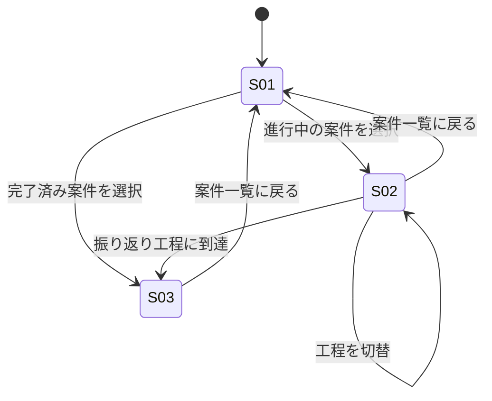

# screens.md — 画面仕様（DRAFT）

> design.md D-00 の判定（情報設計・認知負荷が支配的）に基づき作成。「進行中の参照」と
> 「完了後の振り返り」は目的が異なるため、案件一覧を含め3画面に分割する。

## 画面一覧

| ID | 画面 | 目的（1文） | 由来する Must Have |
|---|---|---|---|
| S01 | 案件ダッシュボード | 担当案件を一覧し、現在の工程を把握して該当ツールへ入る | （導線のためのハブ） |
| S02 | 工程別判断ガイド | 現在工程の判断チェックポイントと相談先候補を提示する | 判断チェックポイント参照／確認・相談タイミング提示 |
| S03 | 完了後フィードバック | 完了案件のAD業務工程ごとの改善点を振り返る | 案件完了後のフィードバック受領 |

## 画面遷移

## S01: 案件ダッシュボード

### 目的
自分が担当する案件を一覧し、進行中か完了済みかを見分けて、目的の画面へ入る。

### 表示要素（Information）
- 案件カード一覧: 案件名、現在工程ラベル（進行中の場合）、完了日（完了済みの場合）
- 進行中／完了済みの切替（タブまたはセクション分割）
- 確認待ちバッジ: 現在工程に未確認の論点がある案件に付与

### アクション（Action）
- 進行中の案件カードを選択: S02（当該案件・当該工程）へ遷移
- 完了済みの案件カードを選択: S03（当該案件）へ遷移

### 表示の分岐（空状態・条件付き表示）
- **空状態（担当案件0件）**: 「現在担当している案件はありません」を表示し、案件依頼の発生を待つ旨を示す
- **条件付き**: 完了済み案件が0件の間は「完了済み」セクション自体を表示しない
- **条件付き**: 確認待ちバッジは、当該工程に未確認の論点が存在する案件のみに表示する

## S02: 工程別判断ガイド

### 目的
選択した案件の現在工程について、判断チェックポイントと「誰に・何を確認すべきか」の材料を提示し、
相談の要否を自分で意思決定できる状態にする。

### 表示要素（Information）
- 工程ステッパー（6工程: 案件依頼→見積・納期設定→デザイン制作→確認・修正→納品・リリース→振り返り）。
  現在地をハイライト表示
- 選択中工程の「確認すべき論点」リスト
- 相談先候補（役割名＋その役割が適する理由）
- 自己判断の記録欄（「相談する／自己判断で進める」を選び、根拠メモを残せる）

### アクション（Action）
- 工程ステッパーの他工程をクリック: 当該工程の論点・相談先候補に表示を切替（同一案件内、S01への遷移なし）
- 「案件一覧に戻る」を選択: S01へ遷移
- 自己判断を記録する: その場で記録欄に反映（保存表現のみ、DRAFTでは永続化は設計しない）

### 表示の分岐（空状態・条件付き表示）
- **空状態（論点が未登録の工程）**: 「この工程の判断チェックポイントは準備中です」を表示し、
  相談先候補のみ提示する
- **条件付き**: 工程⑥「振り返り」をステッパーで選択した場合、判断チェックポイントUIではなく
  S03への導線を提示する（振り返りは判断ではなくフィードバック受領のフェーズのため）
- **条件付き**: 相談先候補は案件の関係者構成（コーディネーター2名／ADの有無等）に応じて変動しうるため、
  該当関係者が案件に存在しない場合はその役割行を表示しない

## S03: 完了後フィードバック

### 目的
完了した案件について、AD業務の各工程に対する具体的な改善点を受け取り、次案件に活かす形で振り返る。

### 表示要素（Information）
- 案件名、完了日
- 工程別フィードバックカード（工程名、良かった点、具体的な改善点）
- 次案件への申し送りメモ欄

### アクション（Action）
- フィードバックカードを展開／折りたたみ
- 「案件一覧に戻る」を選択: S01へ遷移

### 表示の分岐（空状態・条件付き表示）
- **空状態（フィードバックが未記録の案件）**: 「この案件のフィードバックは準備中です」を表示する
- **条件付き**: フィードバックが一部工程にのみ記録されている場合、記録の無い工程のカードは表示しない
  （空のカードを並べて「無回答」に見せない）
