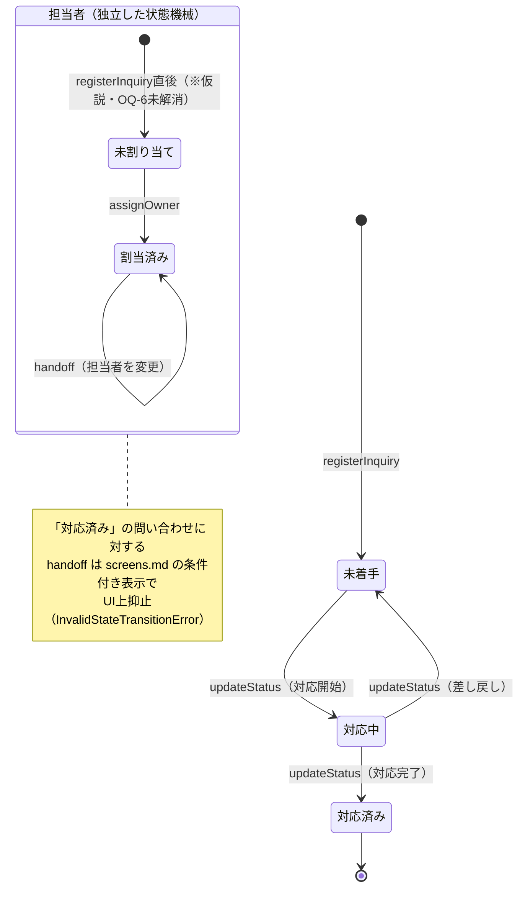
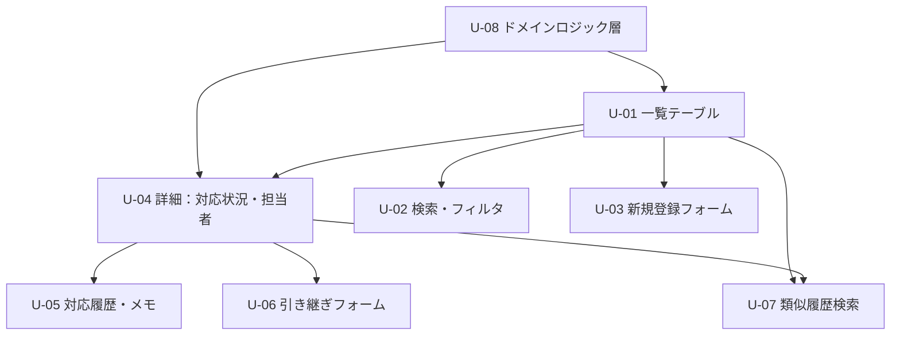

# design.md — 設計文書（ITERATE）

## 設計判断 D-00: 支配的な設計判断の特定

- **支配的な判断**: 情報設計・認知負荷
- **根拠**: requirements.md C-1「複数の問い合わせを並行して処理しながら…緊急対応が通常業務に割り込む状況下で判断を行う」ため認知的余力は常に逼迫。C-2「連続注視時間は業務時間中の並行処理により細切れになりやすい」
- **各モデルの適用可否**:
  - D-01 輝度極性: **非支配的** — C-4（物理環境）は OQ-2 として未確定。強い環境照度要因の記述なし
  - D-02 操作アンカー: **非支配的** — C-3（装置）は OQ-1 として未確定。身体的制約（把持・手袋・移動）の記述なし
  - D-03 情報設計・認知負荷: **支配的** — 複数チャネル一元化・緊急度識別・履歴検索・引き継ぎが要件の中心（M-9〜M-14, M-23）
- **`screens.md` の要否**: 要 — 一覧と詳細で目的が分かれる（最低2画面。M-9〜M-14, M-23）
- **`content.md` の要否**: 要 — 対応状況・緊急度・チャネル種別・空状態など、有限集合の表示文言が製品理解の核（M-9〜M-14）

## 1. 利用文脈サマリ
社内IT担当3名が、Slack・メール・口頭に分散した問い合わせを並行処理する（C-1）。
記録・引き継ぎが中心タスクで、注視は細切れ、認知的余力は逼迫している（C-2）。
装置・物理環境（C-3/C-4）は未確定（OQ-1, OQ-2）、既存 Slack 運用と両立が必須（C-5）。

## 設計判断 D-01: 輝度極性（非支配的）
既定として **Light** を採用する。C-4 が未確定（OQ-2）で通常オフィス照度を仮定するのみであり、
一覧・表形式データの長時間参照との相性から逆行させる根拠がないため、決定モデル①の既定分岐を採る。
- **再検討トリガ**: OQ-2（物理環境：照度・時間帯・夜間対応の有無）が確定次第、決定モデル①の
  Step 1（環境照度の帯域判定）から再評価する。夜間・時間外の緊急対応（M-21）が常態化していると判明した場合、
  Dark 側への加点（暗順応維持・画面が唯一の光源）が発生し得る。

## 設計判断 D-02: 操作アンカー位置（非支配的）
既定として **デスクトップ標準配置**（グローバル操作は上部固定、主要導線は各画面右上）を採用する。
C-3 が未確定（OQ-1）で PC・マウス操作を仮定するのみであり、Fitts の逆算を要する身体的制約の記述がないため。
- **再検討トリガ**: OQ-1（デバイス種別・画面サイズ・入力方式）が確定次第、決定モデル②から再評価する。
  タブレット・タッチ操作や特定の把持姿勢が判明した場合、到達可能領域の再モデリングが必要になる。

## 設計判断 D-03: 情報設計・画面構成

- **決定**: 2画面構成（S01 問い合わせ一覧／S02 問い合わせ詳細）を採用する。実体は `screens.md`。
- **根拠となる利用文脈**: requirements.md C-2「1セッションの操作は、問い合わせの状況確認・記録・他担当者への
  引き継ぎ（M-23）が中心。連続注視時間は業務時間中の並行処理により細切れになりやすい」より、
  「俯瞰して探す」（一覧）と「1件に集中して記録・引き継ぐ」（詳細）という2つの異なる認知モードが存在する。
- **導出プロセス**: Must Have を目的で束ねると、M-9・M-10・M-12（全体可視化・緊急度識別）は「一覧」という
  1つの目的に収束し、M-10・M-11・M-14・M-23（対応記録・引き継ぎ）は「個別の記録」という別の目的に収束する。
  `screen-specification.md` の導出手順（Must Have → 画面 → 表示要素 → アクション）に従い、
  目的が2つに分かれた時点で画面を分けた。
- **棄却した選択肢とその理由**: (a) 単一画面に一覧と詳細を並置する案 ―― 認知的余力が逼迫した状態（C-1）で
  常時2つの情報密度が同時に視界に入り、段階的開示（`screens.md` の「類似の過去問い合わせ」等）が機能しなくなる。
  (b) 3画面以上への分割（例: 検索専用画面を独立させる） ―― 3名の少人数運用で複雑な操作を増やさない
  という M-16/M-17/M-19 の制約に反し、遷移コストが目的の細分化に見合わない。
- **この決定が崩れる条件（再検討トリガ）**: 新規の Must Have が追加され、目的の束が3つ以上に分岐した場合。
  あるいは Should Have の M-6（並び替え・整列）が独立した操作体系を要求するほど複雑化した場合。

## 設計判断 D-04: 技術構成

- **決定**: バックエンド連携を前提としない、クライアント側のみで完結する軽量 SPA 構成を「引き渡し時の推奨構成」
  とする。認証・永続化・アクセス制御の実装は本フレームワークの範囲外（実装フェーズへ委譲）とし、
  本パスでは「重い基盤を持たない」という制約のみを設計に反映する。
- **根拠となる利用文脈**: requirements.md §3 Won't Have「承認ワークフローやSLA自動計算等、大規模ITSM/ITILスイート
  相当の機能（M-19『重いツールを導入したくない』より対象外）」、および §5.2 耐障害性「3名の少人数運用（M-16）を
  前提とするため、外部依存の障害時に復旧手順そのものが専任の対応要員を必要とする設計は避けること」。
- **導出プロセス**: 決定モデル③に requirements.md の制約を代入する。配布方法・寿命・保守体制について
  明示的な制約は無いが、チーム規模（3名、専任の運用担当なし）とセキュリティ境界（M-18：チーム外非公開）
  から、YAGNI 原則に基づき「独自のリアルタイム同期基盤」「重厚な認可基盤」は本イテレーションでは導出されない。
  §5.2 の「Slack連携を単一障害点にしない」という要求は、Slack 連携（M-15）を任意のオプション機能として
  設計し、中核機能（一覧化・記録・履歴参照、M-9〜M-13）がそれに依存しない構成であることを要求する。
- **棄却した選択肢とその理由**: (a) 大規模 ITSM/ITIL 相当のプラットフォーム採用 ―― Won't Have で明示的に
  対象外（M-19）。(b) Could Have の M-22（他担当者の更新をリアルタイム反映）を前提とした WebSocket 常時同期基盤
  ―― 現イテレーションでは Could Have にとどまり Must Have ではないため、YAGNI により見送る。
- **この決定が崩れる条件（再検討トリガ）**: M-22（リアルタイム反映）が Must Have に格上げされた場合、
  同期基盤の追加検討が必要になる。また OQ-4（保持期間・アクセス権限の粒度）が確定し、
  永続化層の要件が明確になった場合、D-04 全体を再導出する。

## 5. 中核ドメインロジックのインターフェースと例外制御フロー

中核データ構造は requirements.md §4「問い合わせ」1エンティティ（属性: 件名・依頼者・チャネル・緊急度・
対応状況・担当者・受信日時・対応履歴）。以下は入出力インターフェースと、§4.2 の不変条件から導出される
例外制御フローである。

| 操作 | 入力 | 出力 | 例外 |
|---|---|---|---|
| `registerInquiry(fields)` | 件名・依頼者・チャネル・受信日時 | 新規「問い合わせ」（対応状況=未着手、担当者=未割り当て※仮説・OQ-6） | 必須項目欠落時は登録を拒否 |
| `assignOwner(inquiryId, ownerId)` | 問い合わせID・担当者ID | 更新後の「問い合わせ」 | **`OwnerConflictError`**: 対象が既に「対応中」で別の担当者が割り当て済みの場合、上書きせず拒否する（§4.2「担当の一意性」） |
| `updateStatus(inquiryId, newStatus)` | 問い合わせID・新しい対応状況 | 更新後の「問い合わせ」 | **`InvalidStateTransitionError`**: 「対応済み」の問い合わせに対する `handoff` 呼び出し等、`screens.md` の条件付き表示が UI 上は抑止している操作が直接呼ばれた場合に送出する（UI 抑止はあくまで一次防御であり、ロジック層でも二重に検証する） |
| `appendHistory(inquiryId, note)` | 問い合わせID・メモ本文 | 追記後の対応履歴一覧 | 既存の履歴エントリを変更・削除する経路は提供しない（§4.2「履歴の追記性」を型で強制する） |
| `handoff(inquiryId, fromOwnerId, toOwnerId, note)` | 問い合わせID・旧担当者・新担当者・引き継ぎメモ | 更新後の「問い合わせ」（担当者変更＋履歴への引き継ぎメモ追記） | `assignOwner` の例外を継承。加えて `note` が空の場合は警告にとどめ拒否はしない（引き継ぎメモの必須化は要件に明示が無い） |

**Slack連携（M-15、受動表示）の失敗時**: §5.2 耐障害性より、Slack 由来のチャネル情報が取得できない場合も
一覧化・記録・履歴参照（M-9〜M-13）は継続可能でなければならない。Slack 由来のラベル表示が失敗した場合は
チャネル欄を空欄またはエラー表示に留め、他の属性の表示・操作をブロックしない（Graceful Degradation）。

## 6. セキュリティ設計

DOM バインド規約（`innerHTML` 等の全面禁止、`textContent`/`createElement`/`addEventListener` の使用義務）は
`.claude/knowledge/shared/frontend-security.md` に準拠し、`figma_make_prompt.md` の Constraints 節・
`Guidelines.md` §1/§8 へ転記済み。本節では M-18（個人情報保護）に対応する**保持境界・権限設計**を定める。

- **アクセス範囲**: requirements.md §5.1「社員名・端末情報等の個人情報は、対応チーム3名（M-1）の範囲でのみ
  閲覧可能でなければならず、それ以外の経路（チーム外への共有・エクスポート等）から到達可能であってはならない」
  を設計制約として採用する。UI 設計上、依頼者情報・担当者情報をチーム外へ送出する導線（エクスポート・
  外部共有ボタン等）を一切設けない。M-14（依頼者への進捗共有）は §D-03 に基づき受動的な共有（画面提示・
  手動連絡）で暫定充足するため、システムからチーム外への自動送信経路自体が存在しない。
- **保持期間**: OQ-4（保持期間・アクセス権限粒度）が未確定のため、requirements.md §5.1 の既定
  「必要最小限の範囲・期間に限定する」を設計原則として据え置く。確定的な自動削除・アーカイブ機能は
  OQ-4 解消まで設計しない（無い機能を実装側が誤って作らないよう、明確に「未設計」と扱う）。
- **権限粒度**: requirements.md には「担当チーム3名」という単位でのアクセス制御のみが記述され、
  チーム内でのロール分割（閲覧専用／編集可能等）は要件に無い。D-04 と同様、認証・認可の実装自体は
  実装フェーズへ委譲するが、設計はチーム内フラットな権限モデル（3名全員が同一の閲覧・編集権限を持つ）
  を前提とし、それ以上の権限分割機能を YAGNI により持ち込まない。
- **漏洩時の影響範囲**: requirements.md §5.1「社内300名規模の組織における特定個人の識別（氏名・使用端末の
  紐付け）」を前提に、依頼者名・担当者名は実在人物を想起させるダミー値であっても本名パターンを避ける
  （`figma_make_prompt.md`「秘匿情報」節に転記済み）。

## 7. 状態遷移図

`対応状況`（未着手／対応中／対応済み）と`担当者`（未割り当て／割当済み）は独立した2つの状態機械として持つ。
`未割り当て` は §4.3 のとおり requirements.md 上は仮説（OQ-6）であるため、図中も明示的に注記する。

## 8. アクセシビリティ方針

requirements.md §5.3 と重複させないため、ここでは design.md 側の設計反映のみを記す（一次情報は §5.3 を参照）。

- **到達目標**: WCAG AA（本文 4.5:1／非テキスト 3.0:1）を既定とする。C-1（視力・色覚特性）・C-4（照度）が
  いずれも未確定（OQ-1〜2 に準ずる情報欠如）のため、`guardrails.md` §8「3 が 5 に勝つ」の例外条件
  （文脈から引き上げる根拠）が現状無く、WCAG の一般解を下限のまま採用する。OQ-1/OQ-2 解消時、D-01 と同様に再評価する。
- **色に依存しない識別**: requirements.md §5.3「緊急度・対応状況等の識別を色のみに依存させないこと」に従い、
  `Guidelines.md` の緊急度バッジ・対応状況表示は、色（`--accent`）に加えて**文字ラベル**（T-06「緊急」／
  T-11〜T-13 の状態文言）を常に併記する。アイコンのみ・色のみでの状態伝達は設計として採用しない。
- **キーボード操作**: C-3（入力方式）は未確定だが、D-02 でデスクトップ・マウス操作を仮定しているため、
  フォーカス可視化とタブ順序は D-02 の操作アンカー（グローバル操作＝上部固定、主要導線＝各画面右上）と
  一致させる。マウス操作を仮定から外す判断（OQ-1 解消時）が下った場合、本項も D-02 と合わせて再設計する。

## 9. ユニット分解と依存関係 DAG

`screens.md` の表示要素・アクションから、実装可能な単位（ユニット）へ分解する。矢印は依存方向（先に実装すべき側が矢印の起点）。

| ID | ユニット | 由来 | 依存 |
|---|---|---|---|
| U-08 | ドメインロジック層（§5 のインターフェース一式） | D-03/D-04 | なし（最初に実装） |
| U-01 | 問い合わせ一覧テーブル（S01［第1］） | M-9, M-10, M-12 | U-08 |
| U-02 | 検索・フィルタ（S01） | M-7, M-13 | U-01 |
| U-03 | 新規登録フォーム（S01） | M-9 | U-08 |
| U-04 | 詳細ビュー：対応状況・担当者表示（S02［第1］） | M-10, M-11 | U-08, U-01（一覧からの遷移） |
| U-05 | 対応履歴・メモ一覧（S02） | M-6, M-7, M-13 | U-04 |
| U-06 | 引き継ぎフォーム（担当者変更＋引き継ぎメモ） | M-23 | U-04 |
| U-07 | 類似の過去問い合わせ検索（S02、段階的開示） | M-7, M-13 | U-01（検索ロジック共有）, U-04 |

## 10. 未確定の前提（Open Assumptions）と要確認事項
- D-01/D-02 は C-3/C-4 未確定のための既定値。OQ-1・OQ-2 が確定次第、再評価が必要（再検討トリガは各 ADR 直下にも転記済み）
- 画面構成は M-9〜M-14, M-23 から2画面（一覧／詳細）と確定的に扱うが、D-03 の再検討トリガに該当する事象が起きた場合は見直す
- content.md の状態・チャネル語彙は仮説であり、次回商談での確認対象（OQ-5 とも関連）
- 「未割り当て」（担当者の初期状態）は `screens.md`/`content.md`/§7 いずれにも記述したが、requirements.md OQ-6 のとおり
  上流未確定の**仮説**である。OQ-6 解消まで確定仕様として扱わない
- D-04（技術構成）は「引き渡し時の推奨構成」であり、実装フェーズを拘束しない（`artifact-templates.md` の規定どおり）
