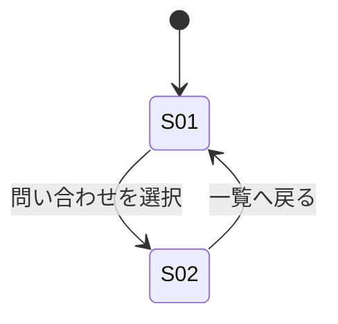

# screens.md — 画面仕様（DRAFT）

## 画面一覧

| ID | 画面 | 目的（1文） | 由来する Must Have |
|---|---|---|---|
| S01 | 問い合わせ一覧 | 全チャネルの問い合わせを一箇所で可視化し、緊急度と対応状況を即座に把握する | M-9, M-10, M-12 |
| S02 | 問い合わせ詳細 | 対応状況・担当者を明確にし、記録と引き継ぎを行う | M-10, M-11, M-14, M-23 |

## 画面遷移

## S01: 問い合わせ一覧

### 目的
全チャネル（Slack・メール・口頭）の問い合わせを一覧化し、緊急度と対応状況を即座に判別できるようにする。

### 表示要素（Information）
- 問い合わせ一覧テーブル **［第1］**: 件名・依頼者・チャネル・優先度・対応状況・担当者
- 優先度バッジ: 一覧上での緊急度の識別（M-12）
- 検索・フィルタ: キーワード／チャネル／対応状況での絞り込み（M-7, M-13）

### 段階的開示（初期表示に出さないもの）
- 対応済み（完了）案件: 既定では非表示。フィルタ操作で表示。現在対応が必要な案件を優先させるため

### アクション（Action）
- 問い合わせを選択: S02 へ遷移
- キーワードで検索する: 一覧を絞り込む
- 新規の問い合わせを記録する: 手動登録（口頭受付分など）

### 表示の分岐（空状態・条件付き表示）
- **空状態**: 進行中の問い合わせが0件のとき、専用メッセージを表示する
- **条件付き**: 優先度バッジは、優先度が設定されている問い合わせにのみ表示する

## S02: 問い合わせ詳細

### 目的
個別の問い合わせについて、対応状況・担当者を明確にし、対応記録と引き継ぎを行う。

### 表示要素（Information）
- 対応状況・担当者表示 **［第1］**: 現在誰が対応中か、状況（未着手／対応中／対応済み）
- 問い合わせ概要: 件名・依頼者・チャネル・受信日時
- 対応履歴・メモ: これまでの対応記録の時系列一覧

### 段階的開示（初期表示に出さないもの）
- 類似の過去問い合わせ（履歴検索結果）: 初期表示に出さず「類似履歴を検索」操作で表示。都度の判断負荷を上げないため

### アクション（Action）
- 対応状況を更新する: 状況ラベルを変更
- 担当者を変更する（引き継ぐ）: 引き継ぎメモとともに担当者を変更
- 対応メモを記録する: 対応履歴に追記
- 一覧へ戻る: S01 へ遷移

### 表示の分岐（空状態・条件付き表示）
- **空状態**: 対応履歴・メモが1件もないとき、専用メッセージを表示する
- **条件付き**: 対応状況が「対応済み」の問い合わせでは、「引き継ぐ」操作を表示しない
