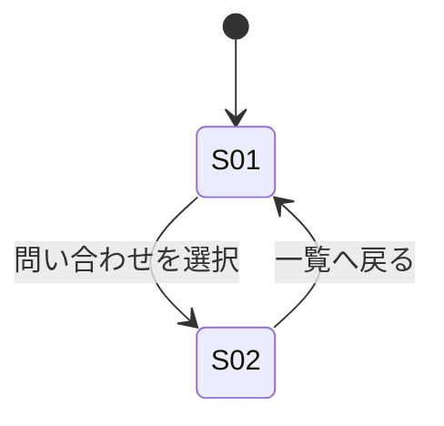

# screens.md — 画面仕様（ITERATE）

## 画面一覧

| ID | 画面 | 目的（1文） | 由来する Must Have |
|---|---|---|---|
| S01 | 問い合わせ一覧 | 全チャネルの問い合わせを一箇所で可視化し、緊急度と対応状況を即座に把握する | M-9, M-10, M-12 |
| S02 | 問い合わせ詳細 | 対応状況・担当者を明確にし、記録と引き継ぎを行う | M-10, M-11, M-14, M-23 |

## 画面遷移

## 設計メモ: M-14（依頼者への進捗共有）／M-15（Slack活用）の充足方法

requirements.md §3 Must Have は、M-14・M-15 のいずれについても「受動的な共有・表示で暫定充足し、
能動的な通知/連携機能が必須かは OQ-5 解消まで断定しない」としている。これを受け、本設計では
以下を **現時点の設計判断** として明記する（quality-agent 検証ゲート2 G2-6 対応）。

- **M-15（Slack活用）**: S01 の一覧テーブルにチャネル列（T-03「Slack」を含む値の集合）を表示することで、
  「Slack由来の問い合わせであることが識別できる」という受動表示の検証基準を満たす。Slack への通知送信・
  Bot操作など能動的な連携機能は、本イテレーションの Elements/Actions には含めない（OQ-5 解消後に再設計）。
- **M-14（依頼者への進捗共有）**: S02 の対応状況・担当者表示（［第1］要素）と対応履歴が、対応者が依頼者へ
  「都度説明し直さず」に口頭・Slack等の既存チャネルで共有する際の**参照元**として機能することで暫定充足する。
  画面から依頼者へ自動送信するアクションは、本イテレーションの Actions には含めない。

いずれも「機能を追加しない」という設計判断であり、欠落ではない。OQ-5 が解消され能動的な通知/連携が
必須と判明した場合、S01/S02 の Actions に新規要素（例: 「進捗を共有する」「Slackへ通知する」）を追加する。

## S01: 問い合わせ一覧

### 目的
全チャネル（Slack・メール・口頭）の問い合わせを一覧化し、緊急度と対応状況を即座に判別できるようにする。

### 表示要素（Information）
- 問い合わせ一覧テーブル **［第1］**: 列は 件名・依頼者・チャネル・緊急度・対応状況・担当者（列見出しの
  文言は content.md T-19〜T-21, T-23〜T-25 を参照。「優先度」ではなく「緊急度」で統一する。requirements.md §4.1 の
  属性定義に対応）
  - 緊急度バッジ: 一覧上での緊急度の識別（M-12）。色（`--accent`）に加え文字ラベル（T-06「緊急」）を
    併記し、色のみに依存しない（requirements.md §5.3）
  - 対応状況・担当者の列は、S02 の表示要素と同一の状態値集合（content.md T-11〜T-13、未割り当て状態は
    T-31 ※仮説）を用いる
- 検索・フィルタ: キーワードによる全文検索（M-7）、チャネルでの絞り込み（M-9由来のチャネル属性）、
  および対応済み案件の表示/非表示切り替え（下記「段階的開示」と対）。**当初案にあった「対応状況の個別
  フィルタ（未着手・対応中を個別に絞り込む）」は Must Have の検証基準（M-9「単一の一覧で確認できる」）を
  満たすために必須ではないため、本イテレーションでは対応済みの表示/非表示切り替えのみに絞る**
  （quality-agent G2-7・実物照合 IT-1-0 #7 を踏まえた精緻化）

### 段階的開示（初期表示に出さないもの）
- 対応済み（完了）案件: 既定では非表示。「対応済みを含む」トグル（content.md T-27）で表示。
  現在対応が必要な案件を優先させるため

### アクション（Action）
- 問い合わせを選択: S02 へ遷移
- キーワードで検索する: 一覧を絞り込む
- チャネルで絞り込む: 一覧を絞り込む
- 対応済みを含む、を切り替える: 対応済み案件の表示/非表示を切り替える
- 新規の問い合わせを記録する: 手動登録（口頭受付分など）。フォーム項目は 件名・依頼者・チャネル
  （必須、requirements.md §4.1）。受信日時は登録操作時刻を自動採用し入力を求めない（M-16/M-17：
  操作数を増やさないため）。担当者は登録時点では選択させない（担当者未定状態については本節末尾の
  「表示の分岐」を参照）。「登録する」（content.md T-32）で確定、「キャンセル」（T-30）で破棄しフォームを閉じる

### 表示の分岐（空状態・条件付き表示）
- **空状態**: 進行中の問い合わせが0件のとき、専用メッセージを表示する（content.md T-02）
- **条件付き**: 緊急度バッジは、緊急度が設定されている問い合わせのみバッジ表示とし、未設定の問い合わせは
  「設定なし」（content.md T-29）を表示する。列を空欄にせず固定幅で表示することで、行ごとにレイアウトが
  ずれることを防ぐ（`Guidelines.md` §4 近接規約との整合）
- **条件付き（仮説・OQ-6）**: 担当者が未割り当ての問い合わせは、担当者列に「未割り当て」
  （content.md T-31）を表示する。この状態自体が requirements.md OQ-6 として上流未確定のため、
  次回商談での確認事項として扱い、確定仕様として固定しない

## S02: 問い合わせ詳細

### 目的
個別の問い合わせについて、対応状況・担当者を明確にし、対応記録と引き継ぎを行う。

### 表示要素（Information）
- 対応状況・担当者表示 **［第1］**: 現在誰が対応中か、状況（content.md T-11「未着手」／T-12「対応中」／
  T-13「対応済み」）。担当者が未割り当ての場合は T-31「未割り当て」を表示する（※仮説・OQ-6、下記「表示の
  分岐」参照）。緊急度と同様、状態は色に加え文字ラベルを併記する（requirements.md §5.3）
- 問い合わせ概要（content.md T-28 見出し）: 件名・依頼者・チャネル・受信日時（S01 の列見出しと同一ラベル、
  T-19〜T-22 を参照）
- 対応履歴（content.md T-33 見出し）: これまでの対応記録の時系列一覧。追記のみで上書きしない
  （requirements.md §4.2「履歴の追記性」／design.md §5 `appendHistory`）。各エントリは記録日時と本文を持つ
- 引き継ぎ先・引き継ぎメモ **（引き継ぎ操作時のみ表示）**: 「引き継ぐ」操作を行った際に開くフォームの
  入力欄。引き継ぎ先（content.md T-34）は次の担当者を選択、引き継ぎメモ（T-35）は申し送り事項を記述する
  自由記述欄（M-23）

### 段階的開示（初期表示に出さないもの）
- 類似の過去問い合わせ（content.md T-36 見出し）: 初期表示に出さず「類似履歴を検索」操作（T-16）で表示。
  都度の判断負荷を上げないため
- 引き継ぎ先・引き継ぎメモの入力フォーム: 「引き継ぐ」操作を押すまでは表示しない。対応状況・担当者を
  眺めるだけの多くの場面で、常時フォームが視界に入ると認知負荷が上がるため

### アクション（Action）
- 対応状況を更新する: 状況ラベル（T-11〜T-13）を変更する。design.md §7 の状態遷移（未着手→対応中→
  対応済み、対応中→未着手の差し戻しを許容）に従う
- 担当者を変更する（引き継ぐ）: 引き継ぎ先・引き継ぎメモの入力フォームを開き、確定すると担当者を変更し
  対応履歴へ引き継ぎメモを追記する（design.md §5 `handoff`）。担当者が未割り当ての問い合わせでは、
  「引き継ぐ」ではなく「担当者を割り当てる」という文言差し替えが将来的に必要になり得るが、OQ-6 未解消の
  ため本イテレーションでは同一操作・同一ラベルのまま扱う（design.md §10 参照）
- 対応メモを記録する: 対応履歴に追記する（上書き不可）
- 類似履歴を検索する: 類似の過去問い合わせ（T-36）を表示する
- 一覧へ戻る: S01 へ遷移

### 表示の分岐（空状態・条件付き表示）
- **空状態**: 対応履歴・メモが1件もないとき、専用メッセージを表示する（content.md T-15）
- **条件付き**: 対応状況が「対応済み」の問い合わせでは、「引き継ぐ」操作を表示しない
  （design.md §5 `InvalidStateTransitionError` の一次防御）
- **条件付き**: 緊急度が未設定の問い合わせでは「設定なし」（T-29）を表示する（S01 と同一規則）
- **条件付き（仮説・OQ-6）**: 担当者が未割り当ての問い合わせでは、担当者表示に「未割り当て」（T-31）を
  表示する。この状態の定義自体が requirements.md OQ-6 として未確定であるため、次回商談で
  「未割り当て状態を許容するか」「初回割り当てと引き継ぎを同一操作にしてよいか」を確認するまでの
  暫定表示として扱う
