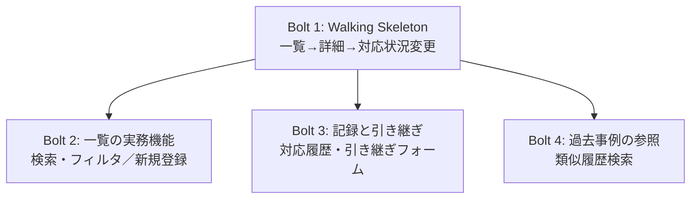

# tasks.md — 引き渡し計画（Bolt 分解と DoD）

> ⚠️ **本フレームワークは実装を行わない。** 本書は確定した仕様（`requirements.md` / `design.md` /
> `screens.md` / `content.md` / `Guidelines.md`）を実装チームへ渡すための分解であり、
> 実装の可否・工数見積り・技術選定の細部は受け取る側が判断する。
>
> Bolt の単位は `design.md` §9 のユニット分解（U-01〜U-08）と依存関係 DAG を土台に、
> 1ユニット＝1Bolt ではなく**垂直スライスとして束ね直したもの**である
> （`.claude/knowledge/quality-agent/delivery-planning.md` §1 に従う）。

## Bolt 一覧と依存関係

| Bolt | 内容 | 含む design.md ユニット | 先行 Bolt |
|---|---|---|---|
| **Bolt 1** | Walking Skeleton | U-08（ドメインロジック層の中核）, U-01（一覧テーブル）, U-04（詳細：対応状況・担当者表示） | なし（最初） |
| Bolt 2 | 一覧の実務機能 | U-02（検索・フィルタ）, U-03（新規登録フォーム） | Bolt 1 |
| Bolt 3 | 記録と引き継ぎ | U-05（対応履歴・メモ）, U-06（引き継ぎフォーム） | Bolt 1 |
| Bolt 4 | 過去事例の参照 | U-07（類似の過去問い合わせ検索） | Bolt 1 |

Bolt 2〜4 は互いに依存しないため、Bolt 1 完了後は並行して着手できる（依存 DAG 上、Bolt 2/3/4 間に順序制約はない）。

---

## Bolt 1: Walking Skeleton（問い合わせの一覧表示 → 詳細表示 → 対応状況の変更）

### 目的
S01（一覧）→ S02（詳細）→ 対応状況の変更という、端から端まで貫通する最小経路を最初に通す。
`design.md` §4.2 の不変条件（担当の一意性・履歴の追記性）と §7 の状態遷移は、
以後すべての Bolt が前提とする土台であり、ここで検証しないと後続 Bolt 全体の手戻りリスクになる
（原則④ リスクの高いものを前倒しする）。

### 含む機能（由来）
- 問い合わせ一覧テーブル（S01［第1］、M-9, M-10, M-12）
- 問い合わせ詳細の対応状況・担当者表示（S02［第1］、M-10, M-11）
- 対応状況の更新操作（`updateStatus`、design.md §5）
- ドメインロジック中核（`registerInquiry` の最小形、`updateStatus`、§4.2 不変条件の型強制）

### DoD（機能・セキュリティ・UX・耐障害性）

**機能**
- [ ] S01 の一覧テーブルに、件名・依頼者・チャネル・緊急度・対応状況・担当者の6列が表示され、行を選択すると S02 へ遷移する（M-9, M-10）
- [ ] S02 で対応状況（未着手／対応中／対応済み）を変更でき、`design.md` §7 の許容遷移（未着手→対応中→対応済み、対応中→未着手の差し戻し）に無い遷移（例: 対応済み→対応中の直接変更）が UI 上で選択できない、または実行時に `InvalidStateTransitionError` 相当の拒否として扱われる
- [ ] `assignOwner` 相当の割り当て操作で、既に「対応中」の問い合わせに別担当者を上書き割り当てできない（§4.2「担当の一意性」）

**セキュリティ**
- [ ] `grep -rn -f <禁止識別子リスト> <実装コード>` の結果が 0 件（`Guidelines.md` §8 の8識別子）
- [ ] 依頼者名・担当者名を表示する要素（一覧の依頼者/担当者列、詳細の対応状況/担当者パネル）から、チーム外へ送出する導線（外部共有ボタン・エクスポート・印刷用の外部リンク発行等）が一切存在しないことを目視確認する（requirements.md §5.1、design.md §6「アクセス範囲」。**認証基盤の実装自体は本 Bolt の範囲外だが、UI 設計として送出経路が無いことは本 Bolt で検証可能**——review_history.md「開放的レビュー」#1 対応）

**UX**
- [ ] S01 で進行中の問い合わせが0件のとき、空状態メッセージ（content.md T-02）が表示される
- [ ] 緊急度が未設定の問い合わせで、バッジ欄が空欄にならず「設定なし」（T-29）が固定幅で表示される（`Guidelines.md` §4 近接規約）
- [ ] 緊急度・対応状況の識別が、色（`--accent`）に加えて文字ラベル（T-06「緊急」、T-11〜T-13）でも行われる（requirements.md §5.3、色のみに依存しない）
- [ ] `--target-primary` / `--target-choice` の最小幅・縮み止め（`flex-shrink: 0`）が適用され、ラベルが縦に積まれない

**耐障害性**
- [ ] Slack 由来のチャネル情報が取得できない状態でも、一覧化・対応状況の表示・変更（中核機能）が継続して動作する（requirements.md §5.2、design.md §5「Graceful Degradation」）

---

## Bolt 2: 一覧の実務機能（検索・フィルタ／新規登録）

### 目的
S01 の残りの Must Have（M-7, M-13 の一覧内検索、M-9 の新規登録）を満たす。

### 含む機能（由来）
- キーワード検索・チャネル絞り込み・対応済み表示切替（S01、M-7, M-9, M-13）
- 新規の問い合わせを手動登録するフォーム（S01、M-9。件名・依頼者・チャネル必須、受信日時自動採用）

### DoD

**機能**
- [ ] キーワード検索・チャネル絞り込み・「対応済みを含む」トグルの組み合わせで一覧が絞り込まれる（M-7, M-9）
- [ ] 新規登録フォームで件名・依頼者・チャネルを入力し「登録する」（T-32）を押すと、対応状況「未着手」の新規問い合わせが一覧に追加される。受信日時は自動採用され入力を求めない（M-16/M-17）
- [ ] 新規登録された問い合わせの担当者初期値の扱いは、`content.md` T-31（「未割り当て」）に従う。**ただし T-31 は requirements.md OQ-6 未解消の仮説値であるため、DoD としては「screens.md/content.md の現行記述どおりに表示されること」までを検証範囲とし、OQ-6 解消後に表示文言が変わり得ることを実装チームへ申し送る**

**セキュリティ**
- [ ] `grep` による禁止識別子検査 0 件（Bolt 1 と同一基準）
- [ ] 新規登録フォームの入力値（件名・依頼者）が、DOM へ `textContent`/`createElement` 経由でのみ反映される（テンプレートリテラルによる HTML 組み立てをしていない）

**UX**
- [ ] 対応済み案件は既定で非表示、トグル（T-27）で表示に切り替わる（段階的開示）
- [ ] 検索結果が0件になっても一覧のレイアウトが崩れず、空状態表現が破綻しない
- [ ] 新規登録フォームの必須項目（件名・依頼者）が未入力のとき「登録する」が実行不能な状態で表示される

**耐障害性**
- [ ] 検索・フィルタの処理が失敗しても、一覧そのものの表示（Bolt 1 の中核機能）はブロックされない

---

## Bolt 3: 記録と引き継ぎ

### 目的
S02 の残りの Must/Should Have（M-7, M-8, M-13 の履歴参照、M-23 の引き継ぎ）を満たす。

### 含む機能（由来）
- 対応履歴・メモの記録と一覧表示（S02、M-6, M-7, M-13。`appendHistory`）
- 引き継ぎフォーム（担当者変更＋引き継ぎメモ、S02、M-23。`handoff`）

### DoD

**機能**
- [ ] 対応メモを記録すると対応履歴に時系列で追記され、既存エントリは変更・削除できない（requirements.md §4.2「履歴の追記性」、design.md §5 `appendHistory`）
- [ ] 「引き継ぐ」操作で引き継ぎ先・引き継ぎメモの入力フォームが開き、確定すると担当者が変更され、対応履歴へ引き継ぎメモが追記される（M-23、design.md §5 `handoff`）
- [ ] 対応状況が「対応済み」の問い合わせでは「引き継ぐ」操作自体が表示されない（screens.md、design.md §5 `InvalidStateTransitionError` の一次防御）。UI 抑止を回避して `handoff` が直接呼ばれた場合も、ロジック層で同様に拒否される（design.md §5 の二重検証方針）

**セキュリティ**
- [ ] 対応履歴・引き継ぎメモの本文が、`textContent` 経由でのみ DOM に反映される（自由記述欄のため、XSS 経路として最も注意を要する）
- [ ] 引き継ぎメモが空のまま確定しても拒否されない（design.md §5「note が空の場合は警告にとどめ拒否はしない」）が、警告表示自体も `textContent` で構成される

**UX**
- [ ] 対応履歴が0件のとき、空状態メッセージ（content.md T-15）が表示される
- [ ] 対応状況変更時のクロスフェード（`--motion-duration-state` 150ms）、引き継ぎフォーム開閉時のトランジション（`--motion-duration-panel` 200ms）が `Guidelines.md` §6 のとおり実装され、`prefers-reduced-motion: reduce` 環境では duration が 0ms になる

**耐障害性**
- [ ] 対応履歴の記録・引き継ぎ操作が失敗しても、既存の履歴エントリ・対応状況表示（Bolt 1 の中核機能）は失われない

---

## Bolt 4: 過去事例の参照

### 目的
S02 の Should Have（M-8「対応ノウハウの属人化緩和」を M-7/M-13 の履歴検索とあわせて補強する）を満たす。

### 含む機能（由来）
- 類似の過去問い合わせ検索（S02、M-7, M-13、段階的開示）

### DoD

**機能**
- [ ] 「類似履歴を検索」（T-16）操作で、類似の過去問い合わせ（T-36 見出し）が表示される。初期表示には出ない（段階的開示、都度の判断負荷を上げないため）

**セキュリティ**
- [ ] 類似の過去問い合わせの内容（件名・解決内容等）が `textContent` 経由でのみ表示される

**UX**
- [ ] 類似の過去問い合わせが0件の場合の表現が定義されており、破綻しない（`figma_make_prompt.md`「正常系だけの画面は、動かした瞬間に破綻します」に対応）
- [ ] `--target-primary` の最小幅・縮み止めが「類似履歴を検索」ボタンに適用されている

**耐障害性**
- [ ] 類似履歴検索が機能しない場合でも、S02 の他の表示・操作（対応状況・担当者・履歴・引き継ぎ）はブロックされない

---

## 引き渡し時の申し送り事項

- **OQ-1〜OQ-6 は未解消のまま引き渡す。** 特に OQ-6（「未割り当て」状態の正式な定義）と OQ-5（Slack 連携の要否）は、
  screens.md/content.md 上で「仮説」「暫定」と明記された箇所に直結するため、次回商談での確認結果によって
  Bolt 2 の担当者初期表示、Bolt 1〜3 の Slack 関連表示が変わり得る
- **`figma_output/01_2026-08-11` の実物は、本 ITERATE で確定した「緊急度」表記に未追随。** `App.tsx` の型名 `Priority`・
  列見出し・新規登録フォームの `legend` に「優先度」が残っている（review_history.md「開放的レビュー」#2）。
  次回 Figma Make 再生成時に、確定済みの `content.md`/`screens.md`/`Guidelines.md` の表記へ揃えること
- **M-18（個人情報保護）のアクセス制御・認証基盤は本フレームワークの範囲外。** design.md §6 のとおり実装フェーズへ委譲する。
  各 Bolt の DoD は「UI 設計上、チーム外への送出導線が無いこと」までを検証範囲とし、認証・認可の実装そのものは
  受け取る側の開発プロセスで別途検証すること
