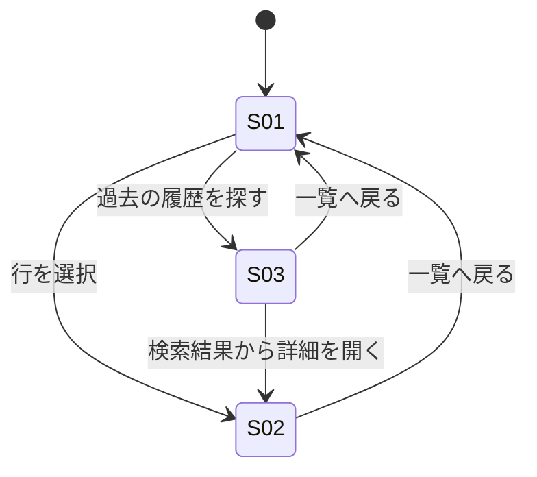

# screens.md — 画面仕様（DRAFT）

> design.md の D-00 にて「情報設計・認知負荷」を支配的判断と特定したため作成。
> 由来識別子 `MH-n` は requirements.md §3 Must Have の掲載順（1〜8）を指す。

## 画面一覧

| ID | 画面 | 目的（1文） | 由来する Must Have |
|---|---|---|---|
| S01 | 問い合わせ一覧 | 全チャネルの問い合わせを一箇所で把握し、放置・重複対応を防ぐ | MH-1, MH-2, MH-3, MH-7, MH-8 |
| S02 | 問い合わせ詳細 | 個々の問い合わせの経緯を把握し、対応を引き継ぐ・進捗を伝える | MH-2, MH-5, MH-6, MH-8 |
| S03 | 過去対応履歴検索 | 過去の同種問い合わせを素早く探し出す | MH-4 |

## 画面遷移

---

## S01: 問い合わせ一覧

### 目的
全チャネル（Slack・メール・口頭）で発生した問い合わせを一箇所に集約し、誰が対応中かを一目で分かる
状態にすることで、放置・重複対応の不安を減らす（MH-1, MH-2, MH-7）。

### 表示要素（Information）
- 問い合わせ一覧テーブル ［第1］: 依頼者・件名・チャネル・状態・緊急度・対応者を行単位で表示
- 状態バッジ: 未対応／対応中／対応済み（MH-2）
- 緊急度バッジ: 緊急／通常。色だけに依存せずラベル文字を併記（MH-3）
- 「対応者になる」インラインアクション（各行に常設、D-02 準拠）
- 状態・緊急度による絞り込みフィルタ、キーワード検索欄

### 段階的開示（初期表示に出さないもの）
- 「対応済み」の行: 初期表示では既定でフィルタから外す／C-1「認知的余力は常に低い状態」のため、
  今対応すべき件のみに絞って表示し、フィルタ操作で明示的に表示させる

### アクション（Action）
- 行を選択: S02 へ遷移
- 「対応者になる」: 自分を対応者として即時確定し、他2名の画面にも反映される
- フィルタ／検索を変更: 一覧を絞り込む
- 「過去の履歴を探す」: S03 へ遷移

### 表示の分岐（空状態・条件付き表示）
- **空状態**（問い合わせ0件）: 「対応が必要な問い合わせはありません」の旨を表示する
- **対応者が既に確定している行**: 「対応者になる」を「対応中：〈担当者名〉」表示に置き換え、
  押下不可にすることで二重着手を防ぐ（MH-2 の検証手段に対応）
- **緊急度「緊急」の行**: 一覧内で他行と明確に区別可能な形で提示する（MH-3 の検証手段に対応）

---

## S02: 問い合わせ詳細

### 目的
対応の経緯を時系列で残し、途中で担当者が交代しても他の2名が現状を把握できるようにする。
あわせて依頼者本人へ進捗を伝えやすくする（MH-5, MH-6）。

### 表示要素（Information）
- 経緯タイムライン ［第1］: 受付内容・対応メモを時系列で表示
- 状態・緊急度・対応者（表示および変更操作）
- 依頼者情報（氏名・連絡チャネル） — 個人情報のため閲覧範囲を対応チーム内に限定（MH-8）
- 対応メモ追記欄
- 「引き継ぐ」「進捗を共有する」アクション

### 段階的開示（初期表示に出さないもの）
- 依頼者の詳細連絡先: 初期表示では簡略表示に留め、対応上必要な操作をした時のみ全文を展開する／
  MH-8「個人情報の閲覧が対応チーム内に限定されている状態」を、不要な露出を避ける形で満たすため

### アクション（Action）
- 対応メモを追記: タイムラインに追記される
- 状態を変更: 未対応→対応中→対応済み
- 「引き継ぐ」: 対応者を自分または他メンバーへ変更
- 「進捗を共有する」: 依頼者へ進捗を伝える導線を開く（本文の具体は Open Questions 参照）
- 「一覧へ戻る」: S01 へ遷移

### 表示の分岐（空状態・条件付き表示）
- **対応者が未定の問い合わせ**: 「引き継ぐ」の代わりに「対応者になる」を表示する
- **状態が「対応済み」の問い合わせ**: 状態変更・追記アクションを読み取り専用表示に切り替え、
  誤って再オープンすることを防ぐ

---

## S03: 過去対応履歴検索

### 目的
過去に同種の問い合わせがあったかどうかを、キーワードから素早く調べられるようにする（MH-4）。

### 表示要素（Information）
- 検索窓 ［第1］: キーワードで過去の対応履歴（対応済み含む全件）を検索
- 検索結果一覧: 該当した過去の問い合わせ（件名・対応概要・対応日）

### 段階的開示
- なし（検索という単一目的の画面のため、外す要素がない）

### アクション（Action）
- キーワードを入力して検索を実行: 結果一覧を更新する
- 結果を選択: 該当する問い合わせの S02 へ遷移する
- 「一覧へ戻る」: S01 へ遷移

### 表示の分岐（空状態・条件付き表示）
- **検索結果0件**: 「該当する過去の対応履歴が見つかりませんでした」を表示し、
  キーワードを変えての再検索を促す
- **未検索（初期表示）**: 結果欄は空のまま、検索を促す案内のみを表示する
