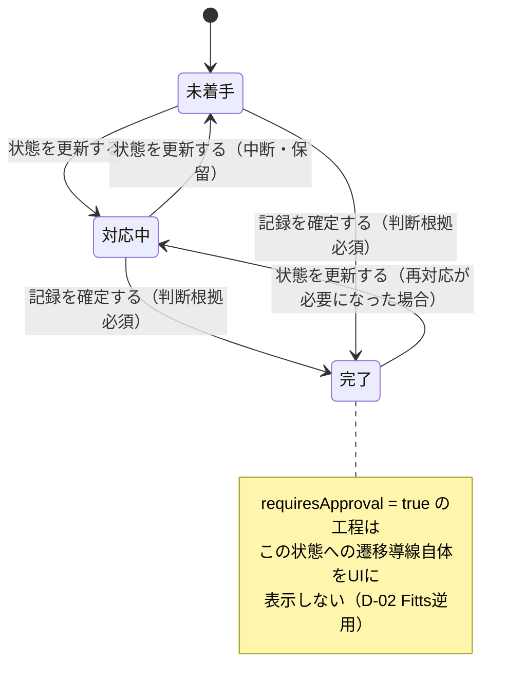
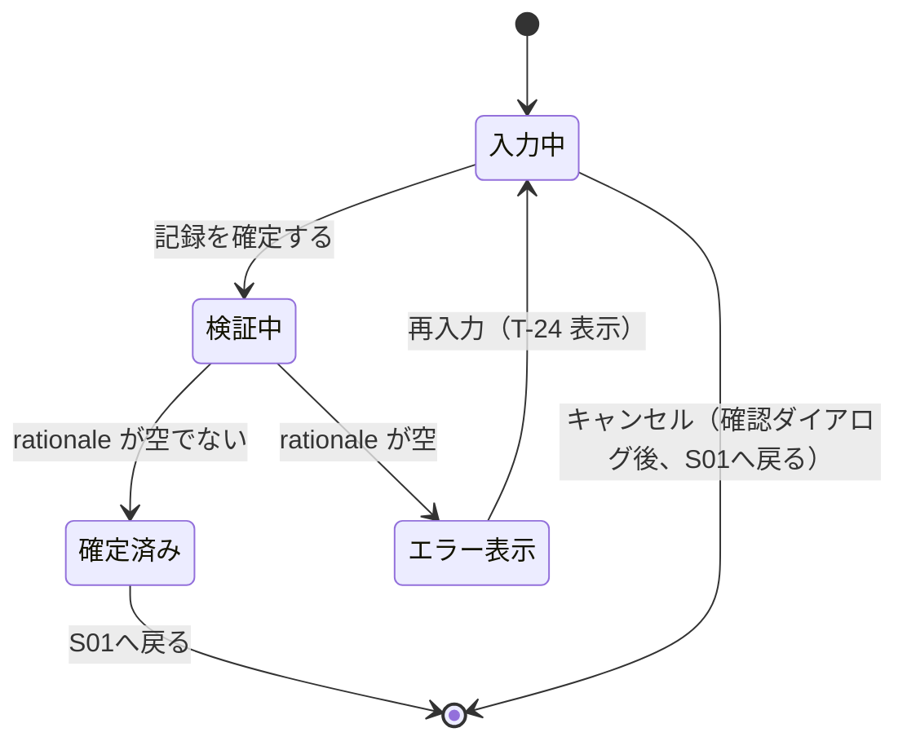
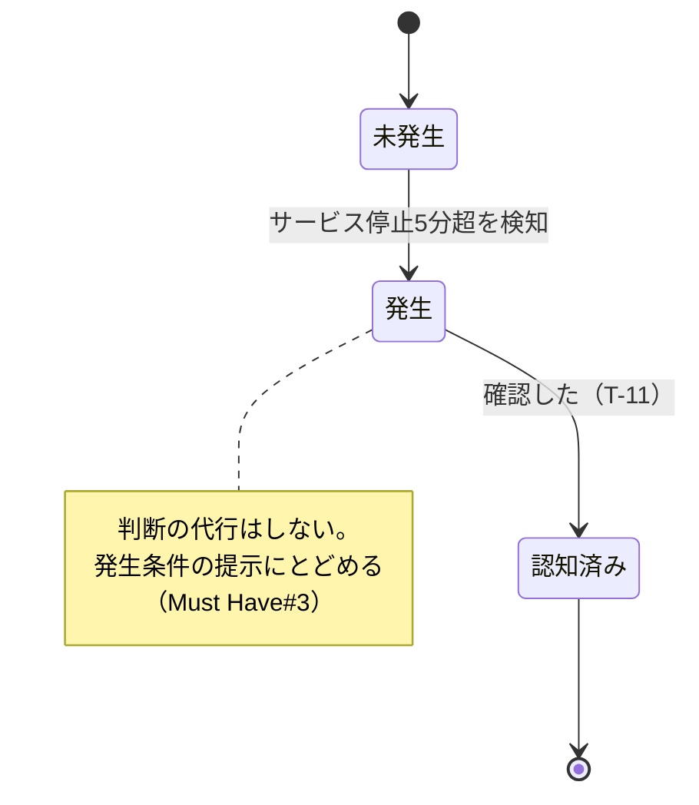
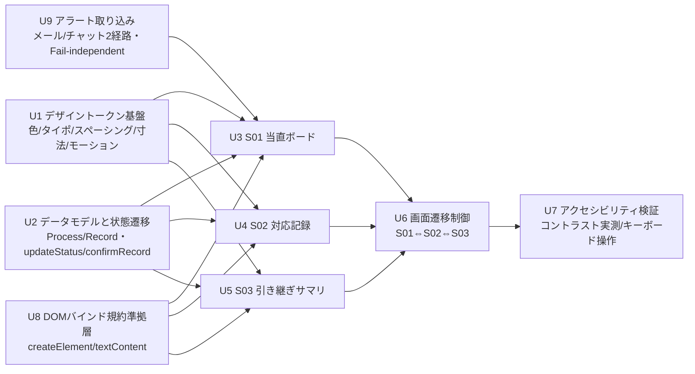

# design.md — 設計文書（ITERATE）

## 設計判断 D-00: 支配的な設計判断の特定

- **支配的な判断**: 身体的制約（D-01/D-02）と情報設計・認知負荷（D-03）の**両方**。どちらか一方に還元できない
- **根拠**: requirements.md C-3/C-4 の記述密度が高い（デュアルモニター／ラップトップ切替／22時自動減光／深夜3時台の立位タイプミス）。同時に C-2「5工程が並行/割り込みで発生」と Must Have「各工程の未完了状態を離れた位置のモニターからでも一目で把握できること」が情報設計側を支配する
- **各モデルの適用可否**:
  - D-01 輝度極性: **支配的** — C-4 の明暗差記述が明確な決定変数
  - D-02 操作アンカー: **支配的** — C-3 の立位操作・タイプミス増加が明確な決定変数
  - D-03 情報設計・認知負荷: **支配的** — 並行5工程の一覧把握が Must Have に明記
- **`screens.md` の要否**: 要 ― 3画面（当直ボード／対応記録／引き継ぎ）。Must Have から画面数が一意に決まらないため
- **`content.md` の要否**: 要 ― コンテンツ駆動型。判断根拠の記録文言・状態ラベル・エスカレーション提示文言が画面から消えると、記録も一覧把握も成立しない

## 1. 利用文脈サマリ

単独当直16時間、5工程並行/割り込み。装置はデスクトップ主＋仮眠室ラップトップ、深夜は立位操作でタイプミス増加。22時に照明自動減光、明暗差が疲労要因（M-18）。

## 設計判断 D-01: 輝度極性の決定

- **決定**: Dark（暗色基調）をシフト全時間帯で採用する
- **根拠となる利用文脈**: requirements.md C-4 より「22時に照明が自動減光（省エネ設定、M-14）」「減光した室内と明るい画面の明暗差が目の疲労要因（M-18）」。C-1「深夜帯は眠気により手指操作の精度が落ちる」
- **導出プロセス**: 決定モデル①Step1 ― 16時間中11時間（22時〜9時）が低照度帯域に該当し、Dark強く優位の範囲に入る。Step2 のタイブレーカーでは、Dark側「画面が主要光源となる時間帯が多い」「短時間の走査的操作（アラート初動確認）が中心」が該当。Light側は「判断根拠記録の長文読解」1項目のみで拮抗しない
- **棄却した選択肢とその理由**: Light基調は22時以降の明暗差（M-18）を悪化させるため棄却。両極性切替（時間帯連動）も検討したが、17〜21時側の照度問題は requirements.md に明記されておらず、要求されていない機能を作らない（YAGNI）ため見送り
- **この決定が崩れる条件（再検討トリガ）**: 17〜21時帯の視認性不満が商談で指摘された場合、またはオンコール対象化（OQ-2）で日中利用が加わった場合に両極性対応を再検討する

## 設計判断 D-02: 操作アンカー位置の決定

- **決定**: 主要導線（状態更新・記録確定）を画面下端に固定し、ターゲット幅を通常より拡大する
- **根拠となる身体的制約**: requirements.md C-3 より「デスクトップPC＋デュアルモニター（監視常時表示＋作業、M-10）が主」「仮眠室対応時はラップトップ（画面小・視認性低、M-13）」「深夜3時台は立位操作・手の重さでタイプミスが増える（M-12）」
- **Fitts 法則による評価**: 主要導線（状態更新・記録確定）について、深夜3時台のタイプミス増加（M-12）＝誤操作率上昇とみなし、Wを拡大して誤操作コストを吸収する。下端固定によりデュアルモニター／ラップトップいずれでも位置が一定となり、視線移動とポインタ移動の合成距離Dを最小化する。対して破壊的操作（ストレージ／ネットワーク変更、M-20）は夜間単独では実行不可・要承認のため本プロトタイプの操作対象外とし、主要導線側のWを最大化する余地に充てる
- **棄却した選択肢とその理由**: サイドパネル固定はデュアルモニター利用時にモニター境界を跨ぐ移動でDが増大するため棄却。中央フローティングは常時監視表示（M-10）を隠すため棄却
- **この決定が崩れる条件（再検討トリガ）**: オンコール対象化（OQ-2）でスマートフォン単独操作が主になった場合、親指到達域基準（片手操作モデル）へ再設計する

## 設計判断 D-03: 情報設計・画面構成の決定

- **決定**: 3画面構成（S01 当直ボード／S02 対応記録／S03 引き継ぎサマリ）を採用し、S01 を情報のハブとするハブ&スポーク型の遷移とする。対応工程は5種の固定種別（`requirements.md` §4）とし、各工程は「状態（未着手／対応中／完了）」と「対応記録（1:N、追記型）」を持つ構造とする
- **根拠となる利用文脈**: requirements.md C-2「5工程が並行/割り込みで発生する」、Must Have#2「複数工程が並行/割り込みで発生しても…各工程の未完了状態を…一目で把握できること」（根拠 M-5〜M-10）、Must Have#1「単独で下した判断・対応内容を…判断根拠ごと裏付けられる形で記録できること」（根拠 M-12, M-22）、Must Have#3「サービス停止5分超…報告義務発生を…見逃さず認知できること」（根拠 M-19）、requirements.md §4 中核データ構造（Process／Record の属性と不変条件）
- **導出プロセス**: `screen-specification.md` の導出順序（Must Have → 画面 → 表示要素 → アクション → content）に従う。4件の Must Have のうち、目的が異なる3系統 ――「状態を一目で把握する（M-5〜M-10）」「判断根拠付きで記録する（M-12, M-22）」「翌当直者へ漏れなく申し送る（M-19 の帰結）」―― が識別でき、目的の束から3画面が導かれる（D-01 由来の Must Have#4 は画面構成ではなくトークンに帰着するため画面数には数えない）。画面遷移はハブ&スポーク型とし、S01 を常に戻り先とすることで、並行/割り込み運用下でのナビゲーションコスト（迷子になるリスク）を最小化する。対応工程を5種の固定リストとして扱うのは、requirements.md §4「実行時の種別追加・削除は想定しない」という不変条件に従う（可変長リストとして設計する根拠が無いため、YAGNI により固定リストを選ぶ）
- **棄却した選択肢とその理由**:
  - 5工程それぞれを個別画面に分ける案 → 工程間の一覧比較（Must Have#2 の一目把握）ができなくなるため棄却
  - 対応記録をS01内のインラインフォーム（画面遷移なし）にする案 → 判断根拠入力欄は複数行かつ確定前検証（§5.3 非機能要件・誤入力回復性）が必要で、常時展開すると一覧性（Must Have#2）を圧迫するため棄却。S02として分離し、段階的開示で対応する
  - 引き継ぎサマリをS01の常設セクションにする案 → 当直中は不要な情報であり、常時表示するとMust Have#2の一覧性を損なうため棄却。S03として独立させ、必要時のみ遷移する構成にした
- **この決定が崩れる条件（再検討トリガ）**: Should Have「経験の浅い担当者への手がかり提示」（M-2）が採用範囲に入った場合、S01/S02に補助情報レイヤーが追加され画面構成の見直しを要する。OQ-7（要承認フラグの割当が M-20 の記述と食い違う可能性）が確定した際、S01 の条件付き表示ロジックを再設計する必要がある

## 設計判断 D-04: 技術構成の決定

- **決定**: 本プロトタイプ（商談用・実装前の「動作する見た目」）はクライアントサイド完結（バックエンド連携なし）で構成する。対応記録はブラウザメモリ内で追記専用（Append-only）に保持し、UI層・ドメインロジック層ともに既存 Record の update/delete API を持たない設計とする。本実装への引き渡し時は、(1) 記録ストアを追記専用スキーマ（イベントソーシングまたは INSERT-only テーブル）とすること、(2) アラート取り込みをメール／チャットの2経路で独立ハンドリングし、一方の障害が他方をブロックしない構成とすることを**推奨構成**として明記する
- **根拠**: requirements.md §5.1「一度確定した記録は事後に上書き・削除されず、訂正が必要な場合は追記としてのみ反映されること」、§5.2「監視システムからのアラートは、メールとチャットの2経路で届く…一方の経路が利用できない状態でも、他方の経路でアラートの覚知が継続でき、業務が完全に止まらないこと」、`figma_make_prompt.md` Task 節「バックエンド連携は不要ですが、空状態と条件分岐は必ず含めてください」（プロトタイプとしての性質規定）
- **導出プロセス**: 決定モデル③に requirements.md の制約を代入する。配布方法＝デスクトップブラウザ単体（C-3）。オフライン要件＝非機能要件に明記なし（Assumptions 行き）。チーム規模＝単独運用（当直は基本1人体制、M-2）。寿命＝商談用プロトタイプ（本フレームワークの範囲は動くプロトタイプまでであり、本実装は対象外）。保守体制＝引き渡し後は受け取り側の開発プロセスに委ねる。セキュリティ境界＝§5.1 の改ざん耐性が最重要制約。これらから、プロトタイプ段階でバックエンド・認証基盤を構築することは YAGNI に反すると判断し見送るが、§5.1／§5.2 は実装段階で必須の非機能要件であるため、D-04 を「引き渡し時の推奨構成」として明記し、実装側が要件を読み落とさないようにする
- **棄却した選択肢とその理由**:
  - プロトタイプ段階でも簡易バックエンド（モックAPI）を構築する案 → 商談用プロトタイプの目的（画面・体験の確認）に対して過剰投資であり、YAGNI に反するため棄却
  - 記録を可変（UPDATE可能）なレコードとして設計する案 → §5.1 の改ざん耐性要件（上書き・削除の禁止）に直接抵触するため棄却
- **この決定が崩れる条件（再検討トリガ）**: 本実装フェーズへ移行し、記録の保持期間・閲覧権限範囲（Assumptions 記載の未確定事項）が確定した場合、ストレージ選定とアクセス制御の設計を追加で行う必要がある。OQ-4（対応ログの現在の記録先）が判明した場合、既存システムとの統合方式を再検討する

## 5. 中核ドメインロジックのインターフェースと例外制御フロー

requirements.md §4「中核データ構造」の Process／Record をそのままドメインモデルとする。

```typescript
type ProcessType = 'alert-triage' | 'restart' | 'batch-check' | 'emergency-call' | 'handover-prep'
type ProcessStatus = '未着手' | '対応中' | '完了'

interface Process {
  readonly id: ProcessType
  readonly name: string                    // T-02〜T-06
  status: ProcessStatus
  readonly requiresApproval: boolean       // 要承認フラグ（M-20）。true の工程は「完了」への導線自体を提示しない
  readonly isOverseasCall: boolean         // 海外拠点フラグ（M-8, M-21）。true の工程のみ英語対応済み確認項目（T-23）を表示
  readonly records: ReadonlyArray<Record>  // 追記専用。配列の直接代入・要素の書き換えを禁止する
}

interface Record {
  readonly id: string
  readonly processId: ProcessType
  readonly rationale: string               // 判断根拠。空文字・空白のみを許可しない
  readonly statusAtRecord: ProcessStatus   // 記録確定時点の状態
  readonly recordedAt: Timestamp           // システム側で自動採番。クライアントから指定不可（§6参照）
}
```

### インターフェース（関数）

```typescript
// 状態のみを更新する。rationale チェックなし。速報的な状態変更に用いる
function updateStatus(processId: ProcessType, next: ProcessStatus): Process

// 判断根拠付きで記録を確定する。確定した Record は追記専用で不変
function confirmRecord(
  processId: ProcessType,
  rationale: string,
  nextStatus?: ProcessStatus
): Record | EmptyRationaleError
```

### 例外制御フロー

- **EmptyRationaleError**: `confirmRecord` で `rationale` が空文字・空白のみのとき発生。S02 で T-24（「判断根拠を入力してください」）を表示し、入力欄へフォーカスを戻す。`updateStatus` はこのチェックの対象外（requirements.md §5.3「入力を伴うすべての操作」の対象は確定操作であり、状態のみの速報更新は誤入力からの回復コストが低いため区別する）
- **要承認フラグ（`requiresApproval: true`）による分岐**: 完了への遷移導線自体を UI に出さない（D-02 の Fitts 逆用と同じ設計思想 ―― 到達できない操作は、誤操作しうる形で存在させない）。したがって「要承認工程を誤って完了にしようとして例外が発生する」経路は原理的に作らない
- **記録の追記そのものは失敗しない設計とする**: バリデーション（`rationale` 非空）を通過した後の追記操作は、必ず成功する。requirements.md §5.1 の改ざん耐性要件を満たすため、確定後の `Record` に対する update／delete の API を実装しない（呼び出せないことで担保する、設計レベルでの禁止であり、UI 側のガードだけに依存しない）
- **アラート覚知の2経路（requirements.md §5.2）**: メール／チャットは Process のドメインロジックの外側（取り込み層）で扱う。一方の経路が失敗しても `alert-triage` 工程の着手自体はブロックされない設計とする（詳細は D-04 の推奨構成、§9 U9 参照）

## 6. セキュリティ設計

### 6.1 DOM バインド規約（例外なき禁止・`frontend-security.md` 準拠）

- `innerHTML` / `outerHTML` / `insertAdjacentHTML` / `document.write` による、判断根拠入力欄（S02）や対応記録一覧（S03）などユーザー入力・自由記述テキストの展開を**全面禁止**する
- 動的要素は `document.createElement()` で生成し、テキストは `.textContent`（または `.innerText`）経由でのみバインドする
- URL を解釈する属性（`href` / `src` / `formaction`）は `setAttribute()` で設定し、`javascript:` / `data:` スキームを拒否する
- イベントは `addEventListener` のみ。インライン `onclick=`、`eval()`、`new Function()`、文字列引数の `setTimeout` を禁止する
- テンプレートリテラルによる HTML 文字列組み立てを禁止する
- フレームワークのエスケープ回避 API（`dangerouslySetInnerHTML`、`v-html` 等）も禁止する
- 禁止識別子リスト（grep 検知用）は `Guidelines.md` §8 に転記し、`scripts/check_forbidden.py` で機械検証する

判断根拠入力欄が本案件で最も攻撃面が広い箇所である（担当者本人の自由記述テキストを、S02 確定後は S01「最近の対応記録」・S03「対応記録一覧」の複数箇所で再表示するため）。すべての再表示経路で `.textContent` 経由のバインドを徹底する。

### 6.2 改ざん耐性・追記性の設計（M-22 由来・requirements.md §5.1）

対応記録は、担当者が翌日以降に「なぜ一人で判断したのか」を自ら裏付けるための証跡である（M-22）。この性質から、記録の完全性は本案件の非機能要件の中で最も優先度が高い。

- **確定後の Record は不変（Immutable）とする**。§5 の通り update／delete の API 自体を実装せず、UI にも「編集」ボタンを設けない。訂正が必要な場合は「追記する」導線のみを提供し、新たな Record を1件追加する形で反映する。既存の確定済みテキストが書き換わる操作を、UI レベルからも作らない（経路の遮断）
- **タイムスタンプ（`recordedAt`）はクライアント入力を許可しない**。システム時刻から自動採番し、S02 では読み取り専用表示とする。担当者が時刻を偽装できないことが、証跡としての信頼性の前提となる
- **検証手段（requirements.md §5.1 準拠）**: 確定済み記録に対する変更操作が、既存内容の置き換えではなく新規追記として残ることを、実装後にレビューで確認する

### 6.3 秘匿情報の保持境界

requirements.md §5.1／Assumptions は「記録の保持期間、および担当者本人以外の誰が閲覧できるかという範囲」を本イテレーションでは扱わないと明記している。この境界を design.md 側で先回りして確定させない ―― 具体的には、プロトタイプ段階でローカルストレージ等への永続化やアクセス制御を独自に追加しない（要件に無い機能を作らない、YAGNI）。保持期間・閲覧範囲が次回商談で確定した時点で、D-04 の推奨構成へ反映する。

## 7. 状態遷移図

### 7.1 工程の状態遷移（5工程共通）



### 7.2 記録確定の例外フロー（S02）



### 7.3 報告義務アラートの認知状態（M-19、工程状態とは独立した軸）



## 8. アクセシビリティ方針

requirements.md §5.3 と一対一で対応させる。

| §5.3 の要件 | 設計での対応 |
|---|---|
| 誤入力からの回復容易性（M-12） | S02「記録を確定する」を押すまで Record は生成されない（下書き状態）。誤操作からの回復は画面を離れるだけで完了する。「キャンセル」操作には確認ダイアログ（T-22）を挟み、未保存内容の破棄を担当者自身に明示的に選ばせる。「状態を更新する」は取り消しではなく再操作（対応中↔未着手）で回復できる設計とする（§7.1） |
| コントラスト比 WCAG 2.1 AA 以上（M-18、OQ-1 を踏まえた引き上げ） | `Guidelines.md` §2 のカラートークンは、本文色 7.0:1・警告色 7.43:1 と AA(4.5:1) を上回る水準を実測で確保。`scripts/check_contrast.py` による機械検証を経ている（review_history.md IT-1-0 で PASS 確認済み） |
| 最小操作での記録完了（M-12, M-22, M-13） | 主要導線の操作回数は「工程を選択（1操作）→判断根拠を入力（1入力）→記録を確定する（1操作）」の3手順。状態選択・英語対応済み確認は自由入力ではなく選択式にとどめ、深夜のタイプミス増加（M-12）の影響を受ける操作を最小化する |

上記に加え、requirements.md に明記されていないが本フレームワークの必須制約（`guardrails.md` §8「知識源の優先順位」1位）として、以下を満たす：

- 状態バッジ（未着手／対応中／完了）と報告義務アラートは、色だけでなく文字ラベルでも弁別できること（OQ-1: 色覚特性未確認のため、色単独に依存させない。P-4 とも整合）
- すべての操作導線はキーボードのみで到達・実行可能であること（フォーカスの可視化を含む）
- 非テキスト要素（境界線・状態バッジの輪郭）のコントラストも 3:1 以上を満たすこと（WCAG 1.4.11、`aesthetic-guardrails.md` §0）

## 9. ユニット分解と依存関係 DAG



| ユニット | 内容 | 依存 |
|---|---|---|
| U1 | `Guidelines.md` のトークンを実装可能な形式（CSS変数等）に落とし込む | なし |
| U2 | §5 のドメインインターフェース（Process/Record、状態遷移関数、EmptyRationaleError） | なし |
| U3 | S01 当直ボード（工程状況一覧・報告義務アラート・シフト残り時間・最近の対応記録・空状態/条件分岐） | U1, U2, U8, U9 |
| U4 | S02 対応記録（判断根拠入力欄・状態選択・英語対応確認・バリデーション・キャンセル確認ダイアログ） | U1, U2, U8 |
| U5 | S03 引き継ぎサマリ（未完了・要フォロー一覧・対応記録一覧要約・報告済み確認欄） | U1, U2, U8 |
| U6 | 画面遷移制御（`screens.md` の画面遷移図の実装） | U3, U4, U5 |
| U7 | アクセシビリティ検証（§8 の各項目の実装後レビュー） | U6 |
| U8 | DOM バインド規約準拠のレンダリング層（§6.1） | なし |
| U9 | アラート取り込み（requirements.md §5.2、D-04 の推奨構成） | なし |

U1／U2／U8／U9 は互いに依存せず並行着手できる。U3〜U5 はこれらが揃って初めて着手可能であり、
S02（U4）の判断根拠入力欄が最も攻撃面が広いため、U8 との結合を最初に検証することを推奨する。

## 10. 未確定の前提（Open Assumptions）と要確認事項

- OQ-1: C-1 の年齢帯・視力/色覚特性が未確認（D-01のコントラスト到達目標に影響しうる）
- OQ-2: オンコール担当者（自宅待機）を対象に含めるか未確定（D-02の操作アンカーが変わりうる）
- OQ-4: 対応ログの現在の記録先・フォーマットが不明（D-03の情報構造、および D-04 の推奨構成における既存システム統合方式に影響）
- OQ-7: 要承認フラグ（requiresApproval）の割当が、現状「再起動対応」にのみ true という実装（`screens.md`/`content.md` の記述）と、requirements.md M-20 の文言（要承認はストレージ／ネットワーク変更側）との間に食い違いがある。§5・§7.1 のドメインロジックはフラグの値そのものには依存しない設計にしているため、フラグの割当が変更されても状態遷移の構造自体は影響を受けないが、S01 の条件付き表示（T-13「要承認」ラベル）の対象工程は次回確認後に修正が必要
- OQ-8: 「タイムスタンプ（自動記録）」の固定ラベル文字列が content.md に未登録。§6.2 の設計は値の自動採番・読み取り専用という振る舞いには依存するが、ラベル文言そのものには依存しないため設計への影響はない。表示上のラベル追加要否は次回確認
- 保持期間・閲覧権限範囲（requirements.md §5.1 Assumptions）が未確定であるため、D-04 はストレージ・アクセス制御の具体構成に踏み込まず「引き渡し時の推奨構成」にとどめている。確定後に D-04 を再導出する
