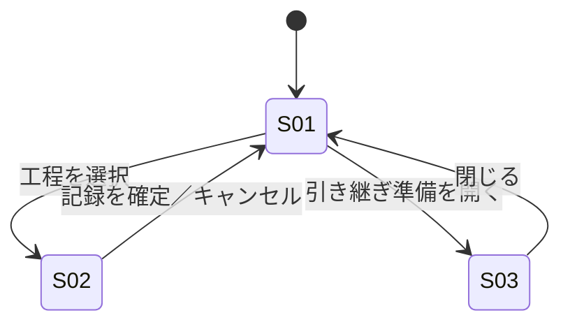

# screens.md — 画面仕様（DRAFT）

## 画面一覧

| ID | 画面 | 目的（1文） | 由来する Must Have |
|---|---|---|---|
| S01 | 当直ボード | 5工程の状態を一目で把握し、次に何をすべきか判断する | M-5〜M-10 |
| S02 | 対応記録 | 対応内容と判断根拠を、最小操作で記録する | M-12, M-22 |
| S03 | 引き継ぎサマリ | 未完了事項と判断根拠を、翌当直者へ漏れなく申し送る | M-19 |

## 画面遷移

## S01: 当直ボード

### 目的
5工程（アラート初動確認・再起動対応・深夜バッチ確認・緊急電話対応・引き継ぎ準備）の状態を、離れたモニターからでも一目で把握する

### 表示要素（Information）
- 工程状況一覧［第1］: 各工程の状態（未着手／対応中／完了）
- 報告義務アラート: サービス停止5分超など組織ルール上の報告義務発生の提示（判断代行はしない）
- シフト残り時間

### 段階的開示（初期表示に出さないもの）
- 各工程の詳細ログ履歴: 状態バッジを選択したときのみ展開／常時表示すると一覧性（Must Have)が崩れるため
- 引き継ぎサマリ全文: S03への遷移時のみ表示／当直中は不要な情報のため

### アクション（Action）
- 工程を選択: S02へ遷移し、当該工程の記録画面を開く
- 報告義務アラートを確認する: 認知済みとして記録する（対応の判断自体は代行しない）
- 引き継ぎ準備を開く: S03へ遷移

### 表示の分岐（空状態・条件付き表示）
- **空状態**: シフト開始直後、全工程が未着手・記録0件のとき「対応記録はまだありません」を表示
- **条件付き**: ストレージ／ネットワーク変更を要する対応は夜間単独では実行不可のため、実行ボタンは出さず「要承認」ラベルのみ表示する

## S02: 対応記録

### 目的
対応内容と判断根拠を、深夜の疲労・タイプミス増加を前提に最小操作で記録する

### 表示要素（Information）
- 判断根拠入力欄［第1］: 未入力では確定できない
- 対応工程名・状態選択（未着手／対応中／完了）
- タイムスタンプ（自動記録）

### 段階的開示（初期表示に出さないもの）
- 過去の類似対応履歴: 「参考を見る」操作をしたときのみ展開／記録という主目的の妨げになるため

### アクション（Action）
- 状態を更新する: 状態のみ変更し、S01へ反映
- 記録を確定する: 判断根拠の必須入力チェック後に確定し、S01へ戻る
- キャンセル: 未保存のままS01へ戻る（確認ダイアログを表示）

### 表示の分岐（空状態・条件付き表示）
- **空状態**: 初回記録時、判断根拠欄は空。入力例のダミー文言は表示せずラベルのみ示す
- **条件付き**: 海外拠点からの電話対応のときのみ、英語対応済みかの確認項目を表示する。それ以外の工程では非表示

## S03: 引き継ぎサマリ

### 目的
未完了事項と判断根拠を、翌当直者へ漏れなく申し送る

### 表示要素（Information）
- 未完了・要フォロー事項一覧［第1］: 完了していない工程と、報告義務が発生したが未報告の項目
- 全工程の対応記録一覧（要約）

### 段階的開示（初期表示に出さないもの）
- 完了済み工程の詳細ログ: 「詳細を見る」操作時のみ展開／引き継ぎ時点で必要なのは未完了事項のため

### アクション（Action）
- 引き継ぎを確定する: 記録を確定し、S01へ戻る
- 詳細を見る: 該当工程の対応記録全文を展開する

### 表示の分岐（空状態・条件付き表示）
- **空状態**: 未完了事項が0件のとき「申し送り事項はありません」を表示
- **条件付き**: サービス停止5分超の報告義務が発生していた工程がある場合のみ、上長への報告済みかの確認欄を表示する
