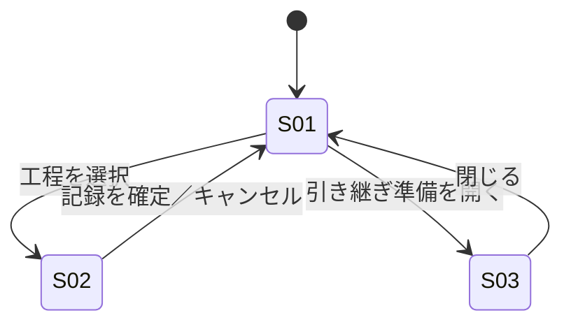

# screens.md — 画面仕様（ITERATE）

## 画面一覧

| ID | 画面 | 目的（1文） | 由来する Must Have |
|---|---|---|---|
| S01 | 当直ボード | 5工程の状態を一目で把握し、次に何をすべきか判断する | M-5〜M-10 |
| S02 | 対応記録 | 対応内容と判断根拠を、最小操作で記録する | M-12, M-22 |
| S03 | 引き継ぎサマリ | 未完了事項と判断根拠を、翌当直者へ漏れなく申し送る | M-19 |

## 画面遷移

## S01: 当直ボード

### 目的
5工程（アラート初動確認・再起動対応・深夜バッチ確認・緊急電話対応・引き継ぎ準備）の状態を、離れたモニターからでも一目で把握する

### 表示要素（Information）
- 工程状況一覧［第1］: 5工程それぞれをカード（またはリスト行）で表示し、各カードに工程名（T-02〜T-06）と状態バッジ（T-07〜T-09）を持つ。バッジの弁別は D-01 の追加義務（Dark採用時の彩度上限）を踏まえ、色だけでなくラベル文字列でも判別できるようにする（色弱対応。OQ-1 未確定のため色単独に依存させない）
- 報告義務アラート: サービス停止5分超など組織ルール上の報告義務発生の提示（判断代行はしない）。工程状況一覧より視覚的に強い警告色（`--accent-alert`）を使うが、面積比は P-6 に従い数％以内に抑える
- シフト残り時間: `--font-size-caption` で表示する補助情報。工程状況一覧の第1階層を上回らない
- 最近の対応記録: 見出し（T-33）＋直近の記録の要約一覧。工程名・状態・記録時刻を1行ずつ表示する。**記録が1件以上あるときのみ表示**（詳細は下記「表示の分岐」参照）

### 段階的開示（初期表示に出さないもの）
- 各工程の詳細ログ履歴: 状態バッジを選択したときのみ展開／常時表示すると一覧性（Must Have)が崩れるため
- 引き継ぎサマリ全文: S03への遷移時のみ表示／当直中は不要な情報のため
- 最近の対応記録: 記録0件のシフト開始直後は出さない／空状態（T-14）と情報として重複するため（下記参照）

### アクション（Action）
- 工程を選択: S02へ遷移し、当該工程の記録画面を開く
- 報告義務アラートを確認する: 認知済みとして記録する（対応の判断自体は代行しない）。確認後はアラート自体を工程状況一覧から取り除かず、確認済みの状態を保持したまま表示を弱める（見逃しを恐れて非表示にすると、後から「発生していた事実」が追えなくなるため）
- 引き継ぎ準備を開く: S03へ遷移

### 表示の分岐（空状態・条件付き表示）
- **空状態（工程状況一覧全体）**: シフト開始直後、全工程が未着手・記録0件のとき、「最近の対応記録」見出しと一覧は表示せず、代わりに空状態文言（T-14「対応記録はまだありません」）のみを表示する
- **条件付き（記録1件以上）**: いずれかの工程で記録が1件以上確定した時点から、「最近の対応記録」見出し（T-33）と要約一覧を表示する。空状態文言（T-14）はこの時点で非表示に切り替わる
- **条件付き（要承認）**: ストレージ／ネットワーク変更を要する対応は夜間単独では実行不可のため、実行ボタンは出さず「要承認」ラベル（T-13）のみ表示する
- **条件付き（報告義務アラート）**: サービス停止5分超が発生していない通常時は、報告義務アラート自体を表示しない。発生時のみ本文（T-10）とボタン（T-11）を表示する

## S02: 対応記録

### 目的
対応内容と判断根拠を、深夜の疲労・タイプミス増加を前提に最小操作で記録する

### 表示要素（Information）
- 判断根拠入力欄［第1］: 未入力では確定できない。複数行テキスト入力。D-02 により入力欄自体もタップ/クリック領域を広めに取り、深夜の手指精度低下（M-12）による誤タップを吸収する
- 対応工程名（T-18ラベル＋工程名 T-02〜T-06のいずれか）: S01から遷移した際に該当工程名を自動表示（再入力不要）
- 状態選択（ラベル「状態」T-32＋選択肢: 未着手／対応中／完了 T-07〜T-09）: `--target-choice` を用いた選択群。現在の状態が選択済みの見た目で表示される
- タイムスタンプ（自動記録）: 記録確定時刻を自動付与し、編集不可の読み取り専用表示とする（改ざん耐性。design.md §6 参照）

### 段階的開示（初期表示に出さないもの）
- 過去の類似対応履歴: 「参考を見る」操作をしたときのみ展開／記録という主目的の妨げになるため
- 英語対応済み確認項目（T-23）: 海外拠点電話対応の工程を選択したときのみ表示（下記「表示の分岐」参照）／それ以外の工程では判断根拠入力を主目的から逸らすため出さない

### アクション（Action）
- 状態を更新する: 状態のみ変更し、S01へ反映。判断根拠が未入力でも状態のみの更新は許可する（「対応中にする」等の速報的な操作を、記録確定の必須入力チェックでブロックしないため）
- 記録を確定する: 判断根拠の必須入力チェック後に確定し、S01へ戻る。確定後の記録内容は編集不可（追記のみ可。design.md §5/§6 参照）
- キャンセル: 未保存のままS01へ戻る（確認ダイアログを表示）

### 表示の分岐（空状態・条件付き表示）
- **空状態**: 初回記録時、判断根拠欄は空。入力例のダミー文言は表示せずラベルのみ示す
- **条件付き**: 海外拠点からの電話対応（緊急電話対応工程）のときのみ、英語対応済みかの確認項目（T-23）を表示する。それ以外の工程では非表示
- **条件付き（バリデーション）**: 判断根拠が未入力のまま「記録を確定する」を押した場合、確定処理を中断しエラー文言（T-24）を判断根拠入力欄の直下に表示する。「状態を更新する」操作はこの制約の対象外

## S03: 引き継ぎサマリ

### 目的
未完了事項と判断根拠を、翌当直者へ漏れなく申し送る

### 表示要素（Information）
- 未完了・要フォロー事項一覧［第1］: 完了していない工程と、報告義務が発生したが未報告の項目。工程名・状態・（あれば）報告義務の未報告フラグを1行ずつ表示
- 全工程の対応記録一覧（要約）: T-27ラベル＋全工程の記録（工程名・状態・判断根拠の冒頭・タイムスタンプ）を時系列で並べる。第1階層ではないため、未完了・要フォロー事項一覧より弱い視覚重み（ウェイト・サイズで区別）とする

### 段階的開示（初期表示に出さないもの）
- 完了済み工程の詳細ログ: 「詳細を見る」操作時のみ展開／引き継ぎ時点で必要なのは未完了事項のため

### アクション（Action）
- 引き継ぎを確定する: 記録を確定し、S01へ戻る
- 詳細を見る: 該当工程の対応記録全文を展開する

### 表示の分岐（空状態・条件付き表示）
- **空状態（未完了・要フォロー事項）**: 未完了事項が0件のとき「申し送り事項はありません」（T-31）を表示
- **空状態（対応記録一覧）**: シフト中に一件も記録が確定していないとき、対応記録一覧の代わりに「対応記録はまだありません」（T-34。S01 の空状態 T-14 と同一文言で統一し、同一概念に別表現を与えない）を表示する
- **条件付き**: サービス停止5分超の報告義務が発生していた工程がある場合のみ、上長への報告済みかの確認欄（T-30）を表示する。発生していなければ確認欄自体を出さない
