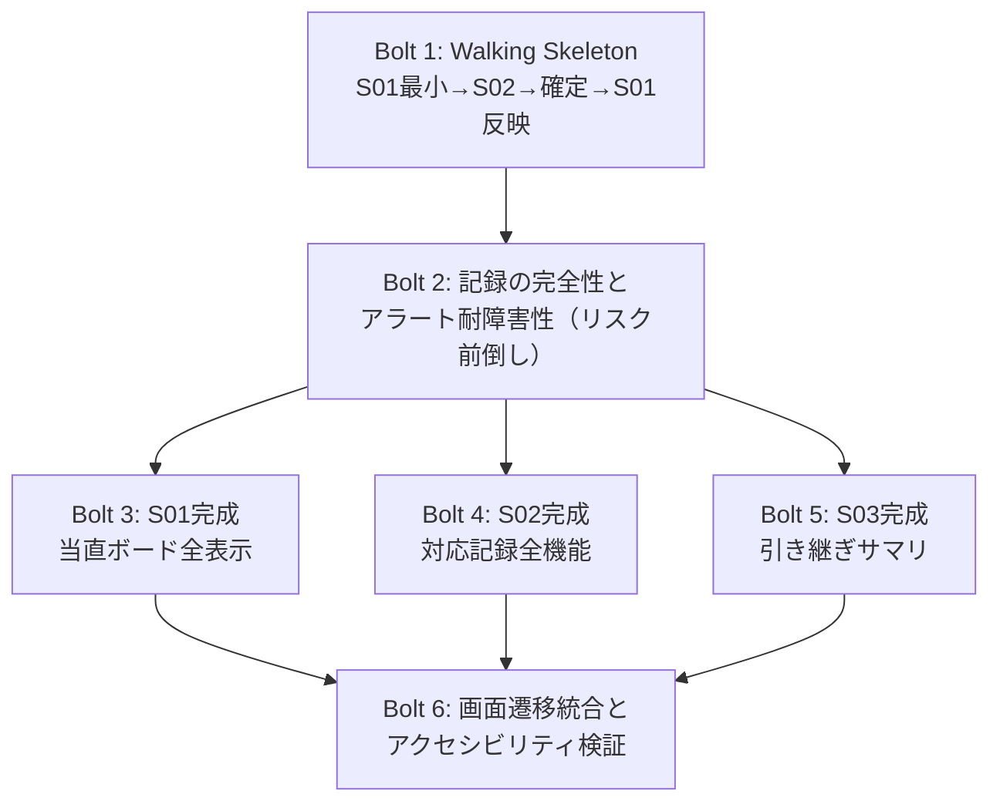

# tasks.md — 引き渡し計画（Bolt 分解と DoD）

> ⚠️ **本フレームワークは実装を行わない。** 本書は確定した仕様（`requirements.md` / `design.md` /
> `screens.md` / `content.md` / `Guidelines.md`）を実装チームへ渡すための分解であり、
> 実装の可否・工数見積り・技術選定の細部は受け取る側が判断する。
>
> Bolt の単位は `design.md` §9 のユニット分解（U1〜U9）と依存関係 DAG を土台に、
> 1ユニット＝1Bolt ではなく**垂直スライスとして束ね直したもの**である
> （`.claude/knowledge/quality-agent/delivery-planning.md` §1 に従う）。

## Bolt 一覧と依存関係

| Bolt | 内容 | 含む design.md ユニット | 先行 Bolt |
|---|---|---|---|
| **Bolt 1** | Walking Skeleton | U1（トークン最小）, U2（Process/Record最小）, U8（DOMバインド基盤）, U3/U4（最小形）, U6（S01⇔S02のみ） | なし（最初） |
| **Bolt 2** | 記録の完全性とアラート耐障害性 | U2（完成）, U9（アラート取り込み2経路） | Bolt 1 |
| Bolt 3 | S01完成（当直ボード） | U3（完成） | Bolt 2 |
| Bolt 4 | S02完成（対応記録） | U4（完成） | Bolt 2 |
| Bolt 5 | S03完成（引き継ぎサマリ） | U5（完成） | Bolt 2 |
| Bolt 6 | 画面遷移統合とアクセシビリティ検証 | U6（画面遷移制御）, U7（アクセシビリティ検証） | Bolt 3, 4, 5 |

Bolt 3〜5 は互いに依存しないため、Bolt 2 完了後は並行して着手できる
（design.md §9 の DAG どおり、U3 は U9 に依存するが U4/U5 は依存しない。
U4/U5 は Bolt 2 完了時点で並行着手可能）。

---

## Bolt 1: Walking Skeleton（S01最小 → S02 → 記録確定 → S01反映）

### 目的
工程を1件選択し、判断根拠を入力して記録を確定し、S01に反映されるまでの、
端から端まで貫通する最小経路を最初に通す。5工程・報告義務アラート・空状態などの
広さは含めない。この経路が通らないと、以後の Bolt すべてが前提を失う（原則① Walking Skeleton）。

### 含む機能（由来）
- S01: 工程カード1件の表示、選択操作（screens.md S01「工程を選択」）
- S02: 判断根拠入力欄、「記録を確定する」操作（screens.md S02、design.md §5 `confirmRecord`）
- ドメインロジック中核（`Process`/`Record` の最小形、`confirmRecord`、`EmptyRationaleError`）
- DOM バインド規約準拠層（`createElement`/`textContent`、design.md §6.1）

### DoD（機能・セキュリティ・UX・耐障害性）

**機能**
- [ ] S01に工程カードが最低1件表示され、選択するとS02へ遷移する（screens.md S01「工程を選択」）
- [ ] S02で判断根拠を入力し「記録を確定する」を押すと Record が1件生成され、S01へ戻る。戻った直後、当該工程の状態表示が確定時点の状態に更新されている（design.md §5 `confirmRecord`）
- [ ] 判断根拠が空文字・空白のみの状態で確定操作を行うと `EmptyRationaleError` 相当として拒否され、S02の入力欄へフォーカスが戻り、エラー文言（T-24）が表示される（design.md §5 例外制御フロー）

**セキュリティ**
- [ ] `grep -rn -f <禁止識別子リスト> <実装コード>` の結果が0件（`Guidelines.md` §8 の8識別子）
- [ ] 判断根拠入力欄の値がDOMへ反映される経路が `textContent`（または `.innerText`）経由のみであり、`innerHTML` 系・テンプレートリテラルによるHTML文字列組み立てを一切含まない（design.md §6.1、本案件で最も攻撃面が広い箇所）

**UX**
- [ ] `--target-primary`（記録を確定する）・`--target-choice`（工程選択）に `Guidelines.md` §5 の最小幅・`flex-shrink: 0` が適用され、ラベルが縦に積まれない
- [ ] S02からS01へ戻る操作（キャンセル）が確定前のどの時点でも可能であり、誤操作から画面を離れるだけで回復できる（requirements.md §5.3）

**耐障害性**
- [ ] この最小経路はバックエンド接続なしで完結し、外部サービスの有無に関わらず動作する（D-04: プロトタイプ段階はクライアントサイド完結）

---

## Bolt 2: 記録の完全性とアラート耐障害性（リスク前倒し）

### 目的
本案件で最も優先度の高い非機能要件（requirements.md §5.1 改ざん耐性・§5.2 アラート2経路の耐障害性）と、
最も技術的不確実性の高い設計判断（D-04「引き渡し時の推奨構成」に留まる技術構成、OQ-7 未確定の要承認フラグ割当）を、
広さを作る前に検証する（原則④ リスクの高いものを前倒しする）。ここで失敗すると Bolt 3〜5 の手戻りが大きい。

### 含む機能（由来）
- Process の5種完全化。`requiresApproval` / `isOverseasCall` を工程種別へのハードコードではなく、
  工程ごとの設定値として保持し、割当変更が値の差し替えのみで完結する構造とする
  （design.md §10「OQ-7: フラグの割当が次回確認後に修正が必要」を踏まえた設計。§5 のドメインロジック自体は
  フラグの値そのものに依存しない設計であるため、割当の変更がロジック層の書き換えを要求しないことを保証する）
- 確定済み Record の不変性（update/delete APIを実装しない。design.md §6.2）
- アラート取り込み層（メール／チャット2経路、Fail-independent。design.md §5「アラート覚知の2経路」、D-04 推奨構成）

### DoD

**機能**
- [ ] Process が5種の固定工程（アラート初動確認／再起動対応／深夜バッチ確認／緊急電話対応／引き継ぎ準備）として保持される（requirements.md §4）
- [ ] `requiresApproval: true` の工程では、完了への遷移導線（アクション）自体がUIに一切提示されない（design.md §5、§7.1 の state 図注記）
- [ ] `requiresApproval` の工程への割当を変更する操作（設定値の差し替え）が、UI側・ドメインロジック側のコード分岐を書き換えることなく行える（design.md §10 OQ-7 対応の設計可用性の確認）

**セキュリティ**
- [ ] 確定済み `Record` に対する update／delete のAPIがコード上に存在しない（呼び出せないことで担保する。design.md §6.2「経路の遮断」）
- [ ] `records: ReadonlyArray<Record>` に対する配列の直接代入・要素の書き換えを行うコード経路が存在しないことを確認する（design.md §5 インターフェース定義）
- [ ] `recordedAt` はシステム時刻から自動採番され、クライアントからの指定・変更を受け付ける入力経路が存在しない（design.md §6.2、証跡としての信頼性の前提）
- [ ] `recordedAt` の内部表現・保存値が日付を含む（時刻のみの保持ではない）。シフトが日付をまたぐため、深夜0時前後の記録の前後関係が一意に判別できる（design.md §6.2、IT-2 開放的レビュー由来）

**UX**
- [ ] `requiresApproval: true` の工程を選択したとき、実行不能な操作を提示する代わりに「要承認（夜間単独では実行できません）」（T-13）のみが表示される（screens.md S01「条件付き（要承認）」）

**耐障害性**
- [ ] メール経路のアラート取り込みを意図的に無効化した状態でも、`alert-triage`（アラート初動確認）工程への着手（S02への遷移・記録確定）がブロックされないことを確認できる（requirements.md §5.2、design.md §5）
- [ ] チャット経路のみを無効化した場合も同様に着手できる（対称性の確認。片方のみを前提にした実装になっていないことの検証）

---

## Bolt 3: S01完成（当直ボード）

### 目的
S01の残りの表示要素・空状態・条件分岐を満たし、5工程並行/割り込み下での一目把握（Must Have#2）を完成させる。

### 含む機能（由来）
- 工程状況一覧の5件完全表示、報告義務アラート、シフト残り時間、最近の対応記録（screens.md S01）
- 全空状態・条件付き表示（screens.md S01「表示の分岐」4種）

### DoD

**機能**
- [ ] 5工程すべてがカードで表示され、各カードに工程名（T-02〜T-06）と状態バッジ（T-07〜T-09）を持つ（screens.md S01）
- [ ] サービス停止5分超の報告義務が発生していない通常時は、報告義務アラート自体が表示されない。発生時のみ本文（T-10）とボタン（T-11）が表示される（screens.md「条件付き（報告義務アラート）」）
- [ ] 「確認した」操作後もアラート自体は工程状況一覧から取り除かれず、確認済みの状態を保持したまま表示が弱められる（screens.md S01「報告義務アラートを確認する」）
- [ ] シフト開始直後、全工程が未着手・記録0件のとき、「最近の対応記録」見出しと一覧は表示されず、空状態文言（T-14）のみが表示される。1件以上確定した時点で表示が切り替わる（screens.md S01「表示の分岐」）

**セキュリティ**
- [ ] 「最近の対応記録」欄（担当者の自由記述 `rationale` を再表示する箇所）が `textContent` 経由でのみDOMへ反映される（design.md §6.1「すべての再表示経路で `.textContent` 経由のバインドを徹底する」）

**UX**
- [ ] 状態バッジ（未着手／対応中／完了）が、色だけでなく文字ラベルでも弁別できる（Guidelines.md P-4、design.md §8）
- [ ] 報告義務アラートの面積比が数％以内に収まっている（P-6、`--accent-alert` の広面積使用の禁止）
- [ ] 工程状況一覧が `screens.md` の「［第1］」指定どおり、その画面で最も強い一要素として扱われている（ウェイト・サイズ・字間による強調。色や影ではない）

**耐障害性**
- [ ] 対応記録の件数集計や状態算出の処理が失敗しても、S01の基本表示（工程状況一覧そのもの）は表示され続ける

---

## Bolt 4: S02完成（対応記録）

### 目的
S02の残りの表示要素・アクション・条件分岐を満たし、最小操作での記録完了（requirements.md §5.3）を完成させる。

### 含む機能（由来）
- 状態選択（未着手／対応中／完了）、英語対応済み確認（海外拠点フラグ条件表示）、キャンセル確認ダイアログ（screens.md S02）
- タイムスタンプの読み取り専用表示（design.md §6.2）

### DoD

**機能**
- [ ] 状態選択（T-07〜T-09の3択）で現在の状態が選択済みの見た目で表示され、「状態を更新する」操作では判断根拠のチェックを行わずS01へ反映される（screens.md S02「アクション」、design.md §5 `updateStatus`）
- [ ] 海外拠点からの電話対応（`isOverseasCall: true`）の工程を選択したときのみ、英語対応済み確認項目（T-23）が表示される。それ以外の工程では表示されない（screens.md S02「表示の分岐」）
- [ ] 未保存の入力がある状態で「キャンセル」を押すと確認ダイアログ（T-22）が表示され、「破棄する」を選んだ場合のみS01へ戻る（screens.md S02「アクション」）

**セキュリティ**
- [ ] キャンセル確認ダイアログの本文（T-22）を含め、ダイアログ内の全テキストが `textContent` 経由で構成される
- [ ] `grep` による禁止識別子検査が0件（Bolt 1と同一基準）

**UX**
- [ ] タイムスタンプ（記録確定時刻）が編集不可の読み取り専用表示であり、入力欄として提示されない（design.md §6.2、改ざん耐性）
- [ ] 判断根拠入力欄が `screens.md` の「［第1］」指定どおり最も強い一要素として扱われ、D-02によりタップ/クリック領域が広めに取られている（M-12の誤タップ吸収）

**耐障害性**
- [ ] 「状態を更新する」操作が失敗しても、S02の他の入力内容（判断根拠の下書き）は失われない

---

## Bolt 5: S03完成（引き継ぎサマリ）

### 目的
S03の表示要素・空状態・条件分岐を満たし、口頭のみの申し送りによる情報漏れ（M-3）を防ぐ。

### 含む機能（由来）
- 未完了・要フォロー事項一覧、対応記録一覧（要約）、上長への報告済み確認欄（screens.md S03）
- 段階的開示（詳細を見る）

### DoD

**機能**
- [ ] 完了していない工程が、未完了・要フォロー事項一覧に1行ずつ表示される。未完了事項が0件のとき「申し送り事項はありません」（T-31）が表示される（screens.md S03）
- [ ] サービス停止5分超の報告義務が発生していた工程がある場合のみ、上長への報告済みかの確認欄（T-30）が表示される。発生していなければ確認欄自体が表示されない（screens.md S03「条件付き」）
- [ ] シフト中に一件も記録が確定していないとき、対応記録一覧の代わりに「対応記録はまだありません」（T-34）が表示される。この文言はS01の空状態（T-14）と同一であり、別の文言が使われていない（screens.md「同一概念に別表現を与えない」、review_history.md V-4関連の記録漏れ対応）
- [ ] 「詳細を見る」操作で該当工程の対応記録全文が展開される（screens.md S03「段階的開示」）

**セキュリティ**
- [ ] 対応記録一覧・詳細展開部の `rationale` 表示が `textContent` 経由でのみDOMへ反映される

**UX**
- [ ] 未完了・要フォロー事項一覧が「［第1］」として最も強い要素として扱われ、対応記録一覧（要約）はそれより弱い視覚重みで表示される（screens.md S03、ウェイト・サイズによる区別）

**耐障害性**
- [ ] 対応記録一覧の要約生成が失敗しても、未完了・要フォロー事項一覧（S03の中核機能）の表示はブロックされない

---

## Bolt 6: 画面遷移統合とアクセシビリティ検証

### 目的
S01⇔S02⇔S03の全遷移を結合し、design.md §8 のアクセシビリティ方針を実装後レビューとして検証する。

### 含む機能（由来）
- 画面遷移制御（screens.md の画面遷移図の実装。design.md §9 U6）
- アクセシビリティ検証（design.md §8、U7）

### DoD

**機能**
- [ ] `screens.md`「画面遷移」のとおり、S01↔S02（工程を選択／記録を確定・キャンセル）、S01↔S03（引き継ぎ準備を開く／閉じる・引き継ぎを確定する）のすべての遷移が実装され、定義されていない遷移（例: S02からS03への直接遷移）が存在しない

**セキュリティ**
- [ ] 実装コード全体に対する `scripts/check_forbidden.py` の実行結果が禁止識別子0件（終了コード0）

**UX**
- [ ] `Guidelines.md` §2 のカラートークンについて、`scripts/check_contrast.py` の再計算結果がすべて要求比率を満たす（本文色7.0:1、警告色7.43:1等）
- [ ] すべての操作導線（工程選択・状態選択・記録確定・キャンセル・引き継ぎ確定を含む）がキーボードのみで到達・実行可能であり、フォーカスの可視化がある（design.md §8）
- [ ] S02のキャンセル確認ダイアログ表示中、キーボード操作によるフォーカスがダイアログ外の要素へ移動しない（フォーカストラップ）
- [ ] 状態バッジ・報告義務アラートの境界線など非テキスト要素のコントラストが3:1以上を満たす（WCAG 1.4.11）
- [ ] OS設定が `prefers-reduced-motion: reduce` のとき、`Guidelines.md` §6 のモーショントークンが位置変化を廃し `opacity` の即時切替に置き換わる

**耐障害性**
- [ ] いずれかの画面（S01/S02/S03）の描画に問題が生じても、他の画面への遷移操作自体は機能を失わない（画面遷移制御がドメインロジックと分離されていることの確認）

---

## 引き渡し時の申し送り事項

- **OQ-1・OQ-2・OQ-4・OQ-7・OQ-8・OQ-9 は未解消のまま引き渡す**（詳細は `requirements.md` §6、`design.md` §10）。
  特に **OQ-7**（要承認フラグの割当）は Bolt 2 の設計（データ駆動化）で実装上の手戻りコストを下げているが、
  次回商談での確認結果によって割当そのものは変わり得る
- **OQ-1・OQ-2 は C-1/C-3/C-4 の確定に関わるため優先確認とする**（requirements.md 末尾の指定を踏襲）
- **requirements.md §5.1 のAssumptions**（記録の保持期間、担当者本人以外の閲覧範囲）は本イテレーションでは未確定。
  D-04 は「引き渡し時の推奨構成」に留まっており、確定後にストレージ・アクセス制御の設計を追加で行う必要がある
  （design.md D-04 再検討トリガ）
- **本 `tasks.md` の Bolt 分解・DoD は、`requirements.md`／`design.md`／`screens.md`／`content.md`／`Guidelines.md` の
  確定記述のみに基づく。** これらに含まれない改善提案は、`review_history.md` の開放的レビュー記録（オーケストレータ採否判断待ち）を参照し、
  採否が決まった時点で該当 Bolt の DoD へ反映すること
- 検証履歴・監査証跡の一次情報は `review_history.md`（追記専用）
