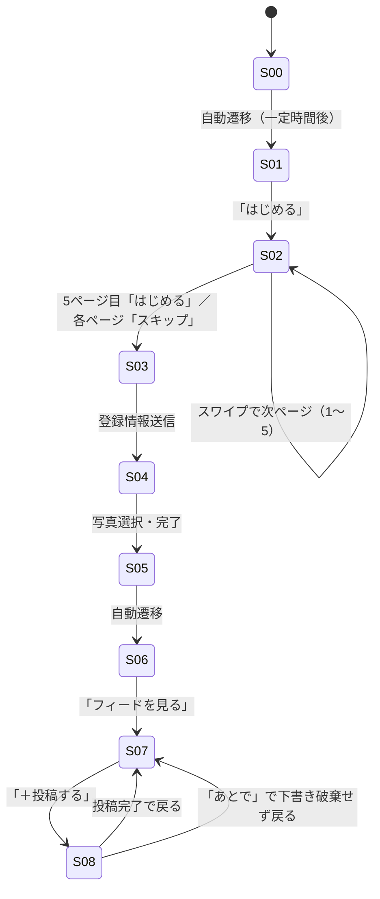

# screens.md — 画面仕様（DRAFT）

> design.md の D-00 にて「情報設計・認知負荷」を支配的判断と特定したため作成。
> オンボーディングは5ページあるが、単一の画面目的（世界観の伝達）を持つカルーセルとして S02 に集約する。

## 画面一覧

| ID | 画面 | 目的（1文） | 由来する Must Have |
|---|---|---|---|
| S00 | 起動スプラッシュ | ブランドの第一印象（ロゴ）を静かに提示する | — （導入部） |
| S01 | 開始画面 | アプリの世界観を一文で伝え、次へ誘導する | オンボーディング |
| S02 | オンボーディング（5ページ） | 使う理由・思想を自然に理解させる | オンボーディング |
| S03 | 登録 | アカウントを作成する | 初回登録 |
| S04 | パーソナライズ | 自分の感性を持ち込み「自分ごと化」する | 初回登録（自分ごと化） |
| S05 | 登録完了 | 登録が完了したことを静かに伝える | 初回登録 |
| S06 | ようこそ | パーソナライズされた歓迎を示し、フィードへ誘導する | 初回登録 |
| S07 | 投稿一覧（共鳴フィード） | 評価ではない静かな反応で他者と共鳴する | 共鳴フィード |
| S08 | 投稿作成 | 写真＋ひとこと＋感情タグで低負荷に感情を残す | 投稿 |

## 画面遷移

---

## S00: 起動スプラッシュ

### 目的
起動直後、ブランドロゴのみを静かに提示し、次画面への橋渡しをする。

### 表示要素（Information）
- ロゴマーク：ブランド名「RESONOTE」

### アクション（Action）
- （操作なし）一定時間後に S01 へ自動遷移

### 表示の分岐
- **該当なし**（分岐を持たない単純な導入画面）

---

## S01: 開始画面

### 目的
アプリのコンセプトを一文で伝え、オンボーディングへ誘導する。

### 表示要素（Information）
- キャッチコピー（content.md 参照）
- ロゴまたはキービジュアル
- 主要 CTA：「はじめる」

### アクション（Action）
- 「はじめる」タップ: S02 へ遷移

### 表示の分岐
- **該当なし**

---

## S02: オンボーディング（5ページ・カルーセル）

### 目的
既存 SNS の評価疲れに対する課題提起から、RESONOTE の「共鳴」という思想、使い方、安心設計までを
5ページで順に伝える（1ページ＝1メッセージ）。

### 表示要素（Information）
- 各ページ：見出し＋本文（content.md 参照）＋ページインジケータ（1/5〜5/5）
- 「スキップ」リンク（常時表示）
- 最終ページのみ「はじめる」CTA

### アクション（Action）
- 左右スワイプ／ドットタップ: ページ送り
- 「スキップ」: 現在ページに関わらず S03 へ遷移
- 最終ページ「はじめる」: S03 へ遷移

### 表示の分岐
- **1〜4ページ目**: 「スキップ」のみ表示、CTA ボタンは非表示
- **5ページ目**: 「スキップ」を「はじめる」に置き換え表示（同一の遷移先のため UI 上は統合してよい）

---

## S03: 登録

### 目的
最小の入力でアカウントを作成する（低負荷であることが C-2 の要件と整合する）。

### 表示要素（Information）
- 登録手段の選択（メールアドレス／SNS連携等 — 具体手段は未確定、Open Questions 参照）
- 利用規約・プライバシーポリシーへの同意導線

### アクション（Action）
- 登録情報送信: S04 へ遷移
- 「戻る」: S02 の最終ページへ

### 表示の分岐
- **入力エラー時**: 送信を無効化し、エラー箇所に即時フィードバックを表示（詳細は ITERATE）

---

## S04: パーソナライズ（自分ごと化）

### 目的
自分の感性を持ち込む最初の一歩として、写真選択などの自分ごと化ステップを提供する
（briefing.md「自分の感性を持ち込みたい → 初回登録で自分ごと化する → 写真選択を制作」に対応）。

### 表示要素（Information）
- プロンプト文言（content.md 参照）
- 写真選択 UI（カメラロールまたはプリセットからの選択）

### アクション（Action）
- 写真を選択して「次へ」: S05 へ遷移
- 「あとで設定する」: 選択をスキップして S05 へ遷移

### 表示の分岐
- **未選択のままスキップした場合**: S06 以降でパーソナライズ演出を省略した一般的な歓迎表示にフォールバック

---

## S05: 登録完了

### 目的
登録が完了したことを静かに、短く伝える（過度な祝祭演出は C-5 の「静けさ」トーンと不整合なため避ける）。

### 表示要素（Information）
- 完了メッセージ（content.md 参照）

### アクション（Action）
- （操作なし）一定時間後に S06 へ自動遷移

### 表示の分岐
- **該当なし**

---

## S06: ようこそ

### 目的
S04 のパーソナライズ結果を踏まえた歓迎メッセージを示し、フィードへ誘導する。

### 表示要素（Information）
- パーソナライズされた歓迎文言（content.md 参照）
- 主要 CTA：「フィードを見る」

### アクション（Action）
- 「フィードを見る」: S07 へ遷移

### 表示の分岐
- **S04 で写真未選択の場合**: パーソナライズ要素を含まない一般文言にフォールバック（content.md 参照）

---

## S07: 投稿一覧（共鳴フィード）

### 目的
家族・親しい人など閉じた関係の中で、評価ではない静かな反応によって他者と共鳴する場を提供する。

### 表示要素（Information）
- 投稿カード一覧：写真・ひとこと・感情タグ・投稿者・共鳴反応（数値強調しない表現）
- 主要 CTA：「＋投稿する」（下端アンカー、D-02 準拠）

### アクション（Action）
- 投稿カードをタップ: 詳細表示（ITERATE で定義）
- 共鳴反応を送る: 静かな反応（いいね数の強調ではない表現。具体形式は Open Questions）
- 「＋投稿する」: S08 へ遷移

### 表示の分岐
- **空状態（初回・投稿0件）**: フィードが空であることを、評価文化を煽らない穏やかな文言で伝える
  （content.md 参照）。「あなたの周りにはまだ投稿がありません」のような欠落訴求を避ける
- **自分の初回投稿直後**: フィード先頭に自分の投稿を表示し、達成感を静かに示す

---

## S08: 投稿作成

### 目的
写真1枚・最大100文字の短文・感情タグの選択のみで、低負荷に感情を残す（Must Have 検証手段に一致）。

### 表示要素（Information）
- 写真選択／撮影
- 感情を促すプロンプト文言（content.md 参照）
- 短文入力欄（上限100文字、残り文字数表示）
- 感情タグ選択（複数候補から選択、content.md 参照）
- 主要 CTA：「投稿する」（下端アンカー）

### アクション（Action）
- 写真選択: プレビュー表示
- 短文入力: リアルタイムで残り文字数を更新
- 感情タグ選択: 選択状態をトグル
- 「投稿する」: S07 へ遷移し、投稿直後トーストで「取り消す」を D 最小・時間限定で提示（D-02 参照）
- 「あとで」: 下書きを破棄せず S07 へ戻る（ITERATE で下書き保存の要否を確定）

### 表示の分岐
- **写真未選択の場合**: 「投稿する」を無効化（写真は必須項目として Must Have に明記）
- **100文字超過**: 入力を許可しつつ超過分を視覚的に警告し、送信を無効化
- **感情タグ未選択の場合**: 「投稿する」の可否は未確定（Open Questions 参照。必須/任意をクライアントに確認）
